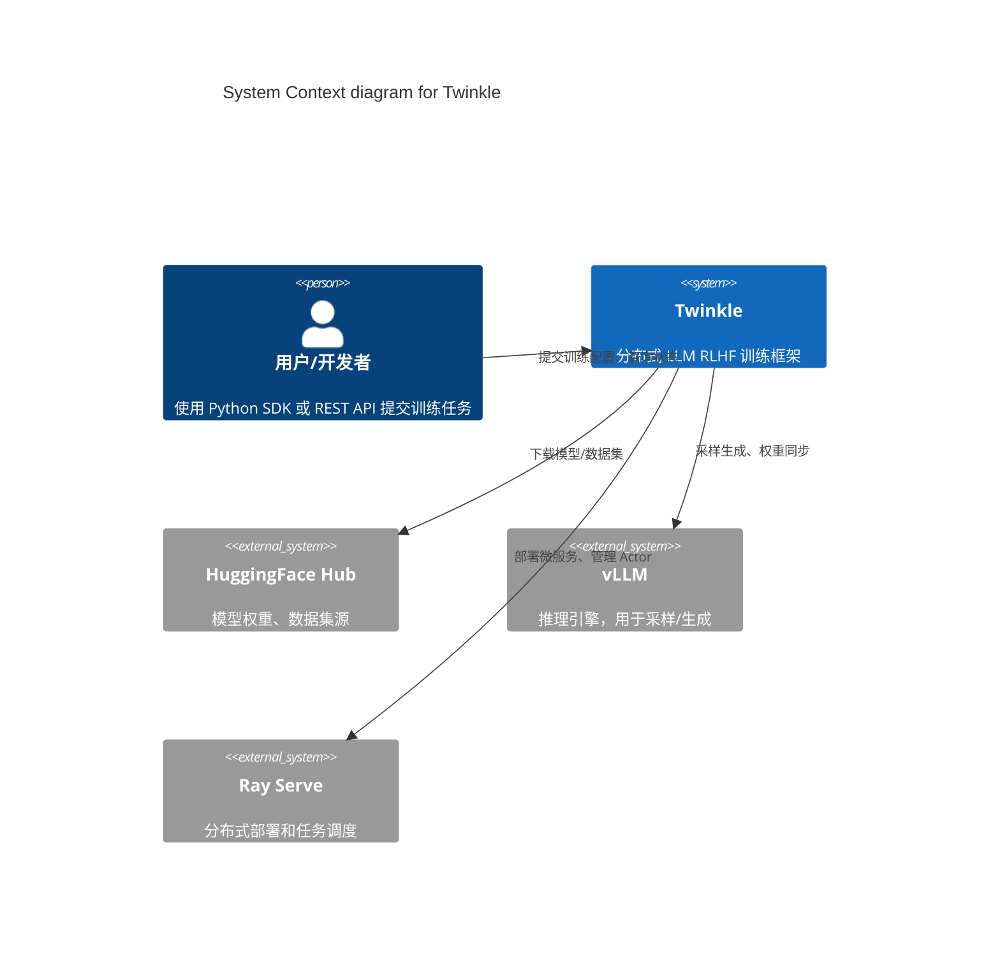
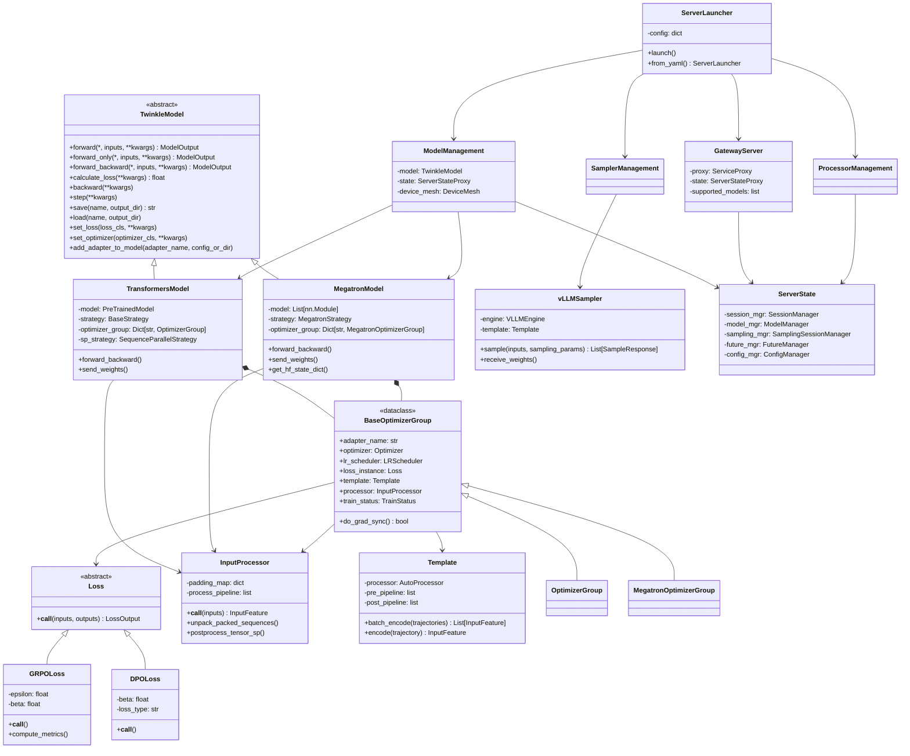
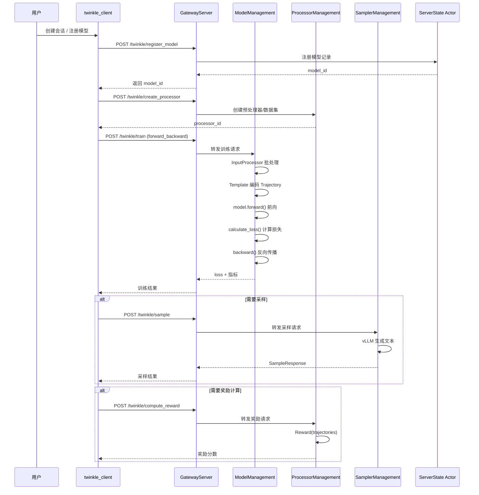
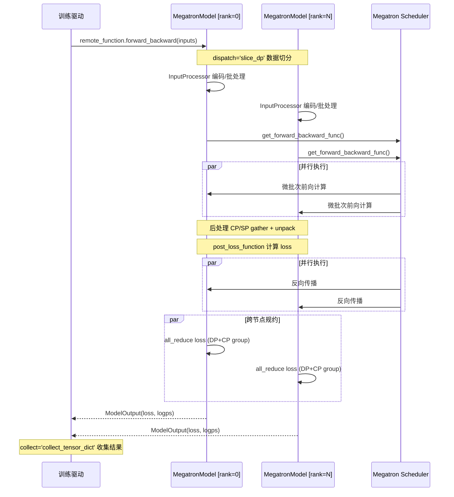
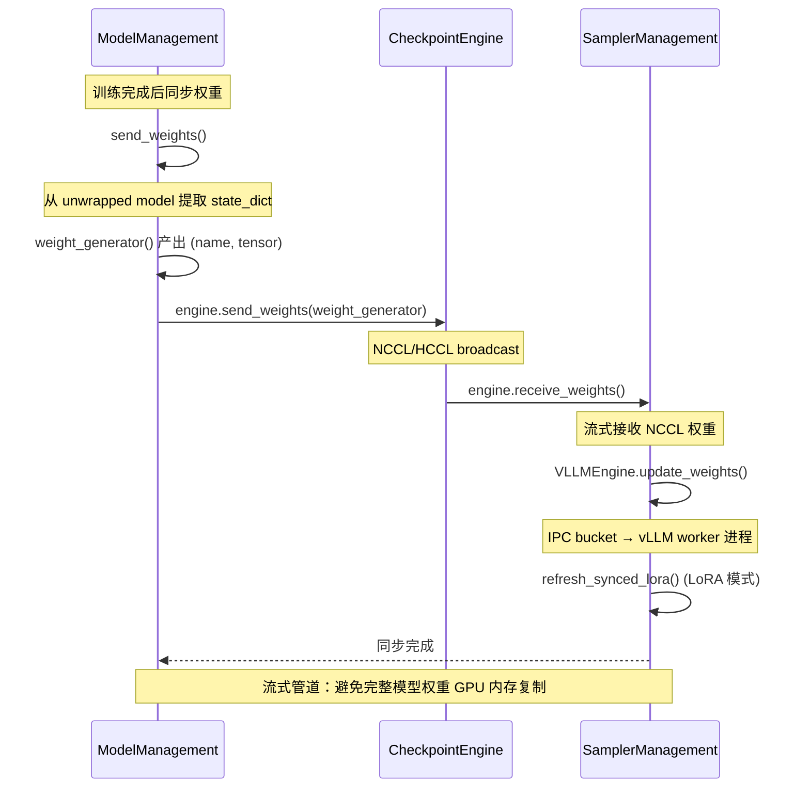

# Twinkle 架构分析报告

> 分析日期：2026-04-28
> 代码库：twinkle-kit v0.3.0.dev0 (ModelScope)
> 分析范围：`src/twinkle/` 核心库（不含 `twinkle_client`）

---

## 1️⃣ 架构总览

### 系统定位

Twinkle 是一个面向大语言模型（LLM）**分布式强化学习训练**（RLHF）的训练框架，支持 SFT、DPO、GRPO、PPO 等多种训练范式。由 ModelScope 团队开发。

核心能力：
- 多后端：HuggingFace Transformers + Megatron-Core 双引擎
- 多并行：DP/TP/PP/CP/EP/FSDP/VPP
- 多目标：SFT、DPO、SimPO、ORPO、GRPO、PPO 等多种损失函数
- LoRA 微调：多适配器并发训练 + 权重实时同步到 vLLM 推理引擎
- 分布式 Ray 部署

### C4 Context 图



### C4 Container 图

```mermaid
C4Container
    title Container diagram for Twinkle

    System_Boundary(twinkle_sys, "Twinkle System") {
        Container(gateway, "Gateway Server", "FastAPI + Ray Serve", "统一 API 网关，路由 Tinker 和 Twinkle 请求")
        Container(model_mgmt, "Model Management", "FastAPI + Ray Serve", "模型训练服务：Transformers/Megatron 双后端")
        Container(sampler_mgmt, "Sampler Management", "FastAPI + Ray Serve", "vLLM 采样服务：文本生成与 logprob 计算")
        Container(processor_mgmt, "Processor Management", "FastAPI + Ray Serve", "数据处理器服务：数据集、预处理器、奖励函数")
        Container(server_state, "ServerState", "Ray Actor", "全局状态管理：会话、模型、采样会话")
        ContainerDb(hf_cache, "Model Cache", "本地磁盘", "HuggingFace 模型/数据集缓存")
    }

    Rel(gateway, model_mgmt, "HTTP 代理请求")
    Rel(gateway, sampler_mgmt, "HTTP 代理请求")
    Rel(model_mgmt, vllm, "通过 CheckpointEngine 同步权重")
    Rel(model_mgmt, server_state, "注册模型/副本")
    Rel(sampler_mgmt, server_state, "注册采样会话")
    Rel(processor_mgmt, server_state, "注册处理器")
```

---

## 2️⃣ 模块划分

### 组件清单

| 模块 | 目录 | 职责 | 关键类 |
|------|------|------|--------|
| 基础设施 | `infra/` | 分布式通信层：远程类/函数装饰器，数据分发/收集 | `remote_class`, `remote_function`, `RayHelper` |
| 数据格式 | `data_format/` | 数据传输对象定义 | `InputFeature`, `Trajectory`, `ModelOutput`, `SamplingParams` |
| 数据集 | `dataset/` | 数据集抽象和迭代器 | `Dataset`, `IterableDataset`, `LazyDataset`, `PackingDataset` |
| 数据加载 | `dataloader/` | 分布式 DataLoader | `DataLoader`, `DeviceMeshSampler`, `RetrySampler` |
| 模型抽象 | `model/` | 模型接口与实现 | `TwinkleModel`, `TransformersModel`, `MegatronModel` |
| 训练策略 | `model/transformers/strategy/` | 分布式训练策略 | `AccelerateStrategy`, `NativeFSDPStrategy`, `SequenceParallelStrategy` |
| 损失函数 | `loss/` | 多种训练目标损失 | `CrossEntropyLoss`, `DPOLoss`, `GRPOLoss`, `SimPOLoss` |
| 模板编码 | `template/` | Chat Template 编解码 | `Template` |
| 输入处理器 | `processor/` | 批处理、填充、打包 | `InputProcessor` |
| 采样引擎 | `sampler/vllm_sampler/` | vLLM 推理封装 | `vLLMSampler`, `VLLMEngine` |
| 奖励函数 | `reward/` | RL 奖励计算 | `Reward`, `MathReward`, `FormatReward` |
| 运行时补丁 | `patch/` | 模型运行时修改 | `Patch`, `MegatronPeft`, `VLLMLoraWeights` |
| 检查点引擎 | `checkpoint_engine/` | 权重复制同步 | `CheckpointEngine`, `NCCLCheckpointEngine`, `HCCLCheckpointEngine` |
| 服务器 | `server/` | Ray Serve 部署层 | `ServerLauncher`, `GatewayServer`, `ModelManagement` |
| 工具 | `utils/` | 通用工具 | `DeviceMesh`, `Platform`, `Logger` |
| 内核 | `kernel/` | 自定义 CUDA 核函数 | `Function`, `Layer`, `Registry` |

### 核心类图



---

## 3️⃣ 核心流程

### 3.1 训练请求路径（Twinkle 同步模式）



### 3.2 分布式训练流程（Megatron 模式）



### 3.3 权重同步流程（训练 → 采样）



---

## 4️⃣ 架构风格

### 4.1 分层架构

系统由四层构成，每层职责清晰分离：

| 层级 | 内容 | 代码证据 |
|------|------|----------|
| **分布式基础设施层** | `infra/` + `utils/` | `remote_class`, `remote_function`, `DeviceMesh` |
| **训练核心层** | `model/`, `loss/`, `processor/`, `template/` | `TwinkleModel`, `InputProcessor` |
| **服务部署层** | `server/` | `ServerLauncher`, `GatewayServer`, `ModelManagement` |
| **客户端层** | `twinkle_client/` | 独立 SDK |

### 4.2 微服务架构（Server 模式）

Ray Serve 提供了四个独立部署的微服务：
- **GatewayServer**（`server/gateway/`）：统一入口，接收所有请求并路由到后端服务
- **ModelManagement**（`server/model/`）：模型训练服务，支持多后端
- **SamplerManagement**（`server/sampler/`）：推理采样服务，基于 vLLM
- **ProcessorManagement**（`server/processor/`）：数据处理服务

各服务之间通过 HTTP 或 Ray Serve 内部 RPC 通信。参考 [server/gateway/proxy.py](src/twinkle/server/gateway/proxy.py) 中的 `ServiceProxy` 类。

### 4.3 管道-过滤器架构（Pipeline-Filter）

系统内部大量使用管道模式处理数据流：

**InputProcessor 处理管道**（[processor/base.py:66-76](src/twinkle/processor/base.py#L66-L76)）：
```python
self.process_pipeline = [
    self.prepare_inputs,
    self.pad_cp,
    self.collate_fn,
    self.to_transformers_dict,
    self.add_extra_padding_free_args,
    self.drop_causal_4d_mask,
    self.split_cp,
    self.apply_transformers_sp,
    self.prepare_outputs,
]
```

**Template 管道**（[template/base.py:55-64](src/twinkle/template/base.py#L55-L64)）：
```python
self.pre_pipeline = [
    self._add_default_system,
    self._to_standard_reasoning_content,
    self._build_standard_messages,
]
self.post_pipeline = [
    self._check_max_length,
    self._add_attention_fields,
    self._roll_labels,
]
```

### 4.4 策略模式（Strategy Pattern）

分布式训练策略通过策略模式实现：

- **Transformers 策略族**：`AccelerateStrategy`, `NativeFSDPStrategy`, `SequenceParallelStrategy`
- **Megatron 策略**：`MegatronStrategy`
- 模型通过 `self.strategy.wrap_model()` 统一接口适配不同并行方案

---

## 5️⃣ 设计模式

### 5.1 装饰器模式（Decorator Pattern）

`infra/__init__.py` 的 `remote_class` 和 `remote_function` 是框架的核心机制。通过在类/方法上添加装饰器，透明地将本地调用转为分布式执行：

```python
@remote_class(execute='all')       # 在远程工作器上创建类实例
class MegatronModel(TwinkleModel):
    ...

    @remote_function(dispatch='slice_dp', collect=collect_tensor_dict, sync=True)
    def forward_backward(self, *, inputs, **kwargs):
        ...
```

- `dispatch`：数据分发策略（`slice`、`all`、`slice_dp`）
- `execute`：执行范围（`first`、`peer`、`all`）
- `collect`：结果收集策略（`mean`、`sum`、`first`、`flatten`、`last_pp`）
- `sync`：同步/异步执行

该设计参考自 PyTorch `DistributedDataParallel` 和 HuggingFace `Accelerate`，但提供了更细粒度的控制。

### 5.2 工厂方法模式

多处使用 `construct_class`（[utils/utils.py](src/twinkle/utils/utils.py)）统一实例化各种插件化的组件：

```python
optimizer = construct_class(optimizer_cls, Optimizer, torch.optim, params=params, **kwargs)
processor = construct_class(processor_cls, InputProcessor, twinkle.processor, **kwargs)
```

允许用户通过字符串名称或类类型配置组件，支持插件化扩展。

### 5.3 组合模式（Composite）

`ServerState` 组合了多个 Manager（[server/utils/state/server_state.py:44-48](src/twinkle/server/utils/state/server_state.py#L44-L48)）：

```python
self._session_mgr = SessionManager(expiration_timeout)
self._model_mgr = ModelManager(expiration_timeout, per_token_model_limit)
self._sampling_mgr = SamplingSessionManager(expiration_timeout)
self._future_mgr = FutureManager(expiration_timeout)
self._config_mgr = ConfigManager()
```

每个 Manager 独立管理一类资源，`ServerState` 统一提供清理和指标聚合。

### 5.4 混入模式（Mixin）

多处采用 Mixin 模式复用功能：

- `TaskQueueMixin`：任务队列 + 速率限制能力
- `AdapterManagerMixin`：LoRA 适配器生命周期管理
- `CheckpointEngineMixin`：权重复制引擎初始化和生命周期
- `ProcessorManagerMixin`：处理器对象生命周期管理

例如 `ModelManagement` 在 [server/model/app.py:32](src/twinkle/server/model/app.py#L32) 中混入了多个 Mixin：
```python
class ModelManagement(TaskQueueMixin, AdapterManagerMixin):
```

### 5.5 适配器模式

解决 **Megatron → HuggingFace** 格式转换问题，通过 `mcore_bridge` 模块（外部依赖）提供适配：

```python
# MegatronModel
self.strategy.bridge.export_weights(model, ...)   # Megatron → HF
self.strategy.bridge.load_weights(model, ...)      # HF → Megatron
```

这使得训练中可以混合使用 Megatron 的高性能并行与 HuggingFace 的生态工具。

### 5.6 异步生成器流式处理

CheckpointEngine 使用异步生成器实现权重流式传输，避免完整模型权重的 GPU 内存复制：

```python
# 训练端：产出流式权重
async def _send():
    await engine.send_weights(weight_generator())  # weight_generator 是生成器

# 采样端：流式接收
async def _receive_and_load():
    await self.engine.update_weights(
        engine.receive_weights(),  # 异步生成器，不会被完整物化到内存
        ...
    )
```

---

## 6️⃣ 设计思想

### 6.1 为什么支持双后端？（Transformers + Megatron）

**Transformers 后端** 使用 HuggingFace 生态，开发体验好、调试方便、社区插件丰富。通过 `Accelerate` 和 `FSDP` 实现基础并行，适合小规模实验和快速迭代。

**Megatron 后端** 使用 NVIDIA Megatron-Core，提供完整的张量并行（TP）、流水线并行（PP）、上下文并行（CP）、专家并行（EP）支持。适用于千亿级参数模型训练。

**核心权衡**：
- Megatron 训练效率更高（显存优化、通信优化），但加载和调试复杂度高
- Transformers 开发效率更高，但大模型训练时显存利用率低

通过 `TwinkleModel` 抽象接口（[model/base.py](src/twinkle/model/base.py)）统一两种后端，上层代码无需关心底层实现。

### 6.2 为什么选 Ray Serve 作为微服务框架？

Ray Serve 提供了：
1. **有状态服务**：ModelManagement 需要持有模型权重和优化器状态
2. **多副本与粘性路由**：`@serve.multiplexed` + `StickyLoraRequestRouter` 实现基于 LoRA 的请求路由
3. **Actor 模型**：ServerState 作为 Ray Actor 提供全局一致的状态管理
4. **与 Ray 生态集成**：分布式任务调度、对象存储

### 6.3 权重同步的设计意图

训练模型和推理引擎（vLLM）可能运行在不同进程乃至不同节点上。传统方案是定期保存 checkpoint 再加载，延迟大。

Twinkle 设计了 `CheckpointEngine`（NCCL/HCCL 版）实现训练→推理的**实时权重同步**：
- 训练端：`MegatronModel.send_weights()` 使用 `get_hf_state_dict()` 将参数转为 HF 格式
- 传输层：NCCL broadcast 实现高效 GPU 间通信
- 接收端：`vLLMSampler.receive_weights()` 流式接收并注入 vLLM 引擎

这种设计使得 RL 训练中可以在每个 epoch 后快速将更新后的策略网络权重同步到采样器中。

### 6.4 为什么区分 Tinker 和 Twinkle 协议？

**Tinker**（`server/gateway/tinker_gateway_handlers.py`）：
- 异步请求-轮询模型：提交任务后获取 request_id，轮询结果
- 适合长时间训练任务（如 GRPO 需要多次 forward_backward）

**Twinkle**（`server/gateway/twinkle_gateway_handlers.py`）：
- 同步请求-响应模型：直接等待结果
- 适合短操作（如单步训练、配置查询）

两种协议共享同一组后端服务，仅网关层做协议转换。

### 6.5 组件实例化与生命周期管理

系统设计了完整的对象生命周期管理：
1. **创建**：通过 `create_processor` 等 API 创建处理器对象，注册到 `ServerState`
2. **粘性路由**：`@serve.multiplexed` 保证同一 session 的请求始终路由到同一副本
3. **过期清理**：后台 `_cleanup_loop` 定期清理过期会话和资源
4. **计数任务**：`_ensure_countdown_started()` 在用户级别限制并发资源数

---

## 7️⃣ 权衡与技术债

### 7.1 已知权衡

| 权衡 | 选择 | 代价 |
|------|------|------|
| 双后端 | 支持 Transformers + Megatron | API 抽象层的复杂性；部分功能在 Megatron 中不可用（如分离 forward/backward） |
| 微服务架构 | Ray Serve 多部署 | 部署复杂度高；本地调试需模拟 Ray 环境 |
| 两种客户端协议 | Tinker(异步) + Twinkle(同步) | 维护两套 handler 代码；开发者需理解两种模式 |
| padding-free 训练 | 支持 packed sequence | 增加 CP/SP 后处理复杂度；`unpack_packed_sequences` 和 `postprocess_tensor_cp` 逻辑复杂 |
| GPRO 训练 | 后处理中展开 packed 序列 | 增加 `_unpack_by_position_ids` 等复杂逻辑 |

### 7.2 技术债

1. **`infra/__init__.py` 耦合过高**（约 720 行）：
   - `remote_class` 和 `remote_function` 两个核心装饰器与 `_dispatch_args`、`_collect_func` 等逻辑混合在单文件中
   - 本地模式与 Ray 模式的逻辑用大量 `if/else` 分支处理
   - `_dispatch_args` 的 `slice_dp` 分支引用了 `device_mesh` 的 `get_slice` 和 `get_data_rank_from_global_rank`，对 DeviceMesh 耦合过紧

2. **InputProcessor 职责过多**（[processor/base.py](src/twinkle/processor/base.py)）：
   - 单文件 657 行，同时处理：张量转换、CP 填充/切分、SP 预处理、Collation、Packing/Unpacking
   - `_collate_macro_batch` 内部大量条件分支（padding_free vs non-padding、megatron vs transformers、mrope vs 普通 position_ids）

3. **MegatronModel 文件过长**（[model/megatron/megatron.py](src/twinkle/model/megatron/megatron.py), 1643 行）：
   - 包含模型初始化、forward_backward（~150行）、保存、加载、权重同步等全部逻辑
   - `_save_mcore_optimizer` 和 `_load_mcore_optimizer` 逻辑重复度高

4. **魔数 Hardcode**：
   - `padding_map` 的 `-100` 标签硬编码多次
   - 多处 `42` 作为默认 seed

5. **字符串驱动的插件系统**：
   - `construct_class` 通过字符串查找类，静态分析困难
   - 错误提示依赖运行时异常，缺乏编译期检查

6. **边缘设备特殊处理**：
   - 多处 `if Platform.device_prefix() == 'npu'` 分支，增加了条件复杂度
   - `drop_causal_4d_mask`（[processor/base.py:291](src/twinkle/processor/base.py#L291)）专门为 NPU 处理

---

## 8️⃣ 改进建议

### 8.1 高优先级（影响可维护性）

1. **将 `infra/__init__.py` 拆分为多文件**：
   ```
   infra/
     __init__.py         # 只导出
     decorators.py       # remote_class, remote_function
     dispatch.py         # _dispatch_args
     collect.py          # _collect_func
     mode.py             # _mode 状态管理
   ```

2. **将 InputProcessor 按职责拆分**：
   - `InputProcessor` → 基础批处理逻辑
   - 抽离 `CPSplitMixin`（CP 切分/拼接）
   - 抽离 `SPSupportMixin`（Sequence Parallel 支持）
   - 抽离 `PackingMixin`（Packed Sequence 处理）

3. **将 MegatronModel 拆分**：
   - `MegatronModelBase`：核心训练接口（forward_backward, step）
   - `MegatronCheckpointMixin`：checkpoint 保存/加载（已有 `CheckpointEngineMixin`，但可进一步拆分）
   - `MegatronWeightSync`：权重同步逻辑

### 8.2 中优先级（影响扩展性）

4. **抽象训练后端注册机制**：当前双后端通过 `if use_megatron` 分支选择，建议改为注册表模式：
   ```python
   MODEL_BACKENDS.register('megatron', MegatronModel)
   MODEL_BACKENDS.register('transformers', TransformersModel)
   ```
   这样用户可以注册自定义后端。

5. **引入配置 Schema 验证**：当前配置（YAML/dict）只做简单 `dict.get` 读取，建议引入 Pydantic 模型或 `dataclass` 做编译期验证。

### 8.3 低优先级（优化）

6. **消除重复的 `42` seed**：定义全局 `DEFAULT_SEED = 42` 常量。

7. **`_ensure_lora_dtype` 性能优化**：当前方法遍历模型全部参数，建议只遍历 LoRA 参数。

---

> **总结**：Twinkle 是一个设计精良的分布式 RLHF 训练框架，架构上采用了**分层 + 微服务 + 管道-过滤器 + 策略模式**的组合。核心优势在于双后端支持、多训练范式、高效的训练-推理权重同步。主要技术债集中在部分文件过大和条件分支过多，但不影响核心功能的正确性和性能。
