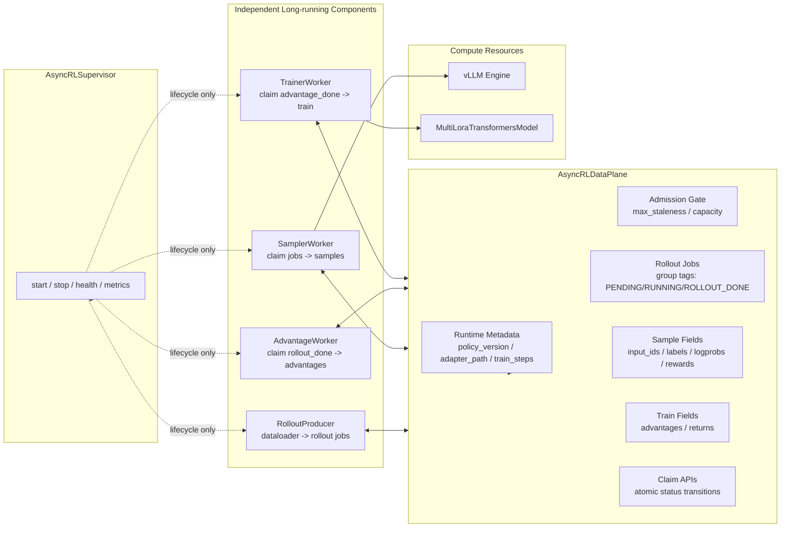
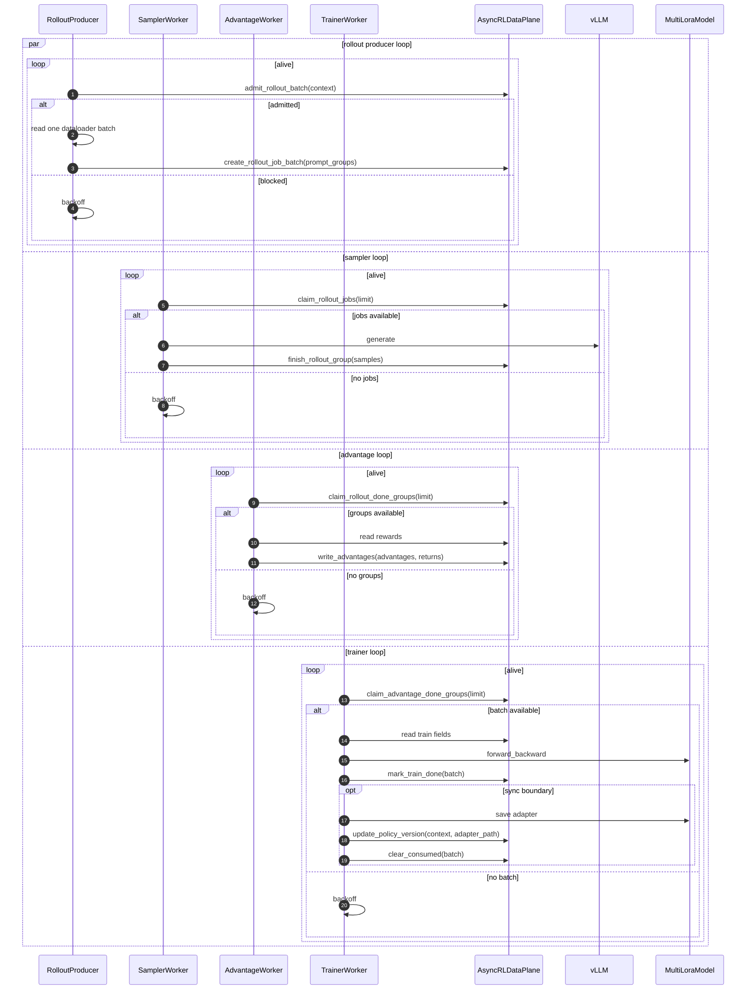
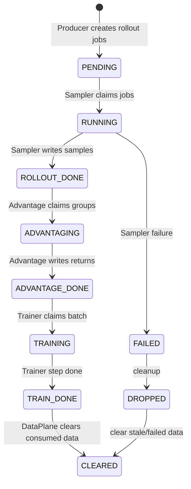

# Multi-LoRA Async RL 新架构草图

## 核心原则

新架构不再使用 runner tick 组件，也不允许组件之间互相调用形成同步链。

所有组件都是独立常驻 loop：

```text
RolloutProducer   只读 dataloader，只向 DataPlane 写 rollout jobs
SamplerWorker     只从 DataPlane claim rollout jobs，生成后写 samples
AdvantageWorker   只从 DataPlane claim rollout_done groups，写 advantages
TrainerWorker     只从 DataPlane claim advantage_done groups，训练并更新 policy version
Supervisor        只负责启动、停止、健康检查、drain 判断
```

组件之间的唯一交互面：

```text
AsyncRLDataPlane
```

也就是说：

- RolloutProducer 不直接调用 Sampler。
- Sampler 不直接通知 AdvantageWorker。
- AdvantageWorker 不直接通知 TrainerWorker。
- TrainerWorker 不直接唤醒 RolloutProducer。
- trainer 训练耗时只阻塞 trainer 自己，不阻塞 rollout / sampler / advantage。

## 架构图



## DataPlane API 边界

`AsyncRLDataPlane` 是唯一状态源，也是唯一跨组件通信面。

建议收敛为这些粗粒度 API：

```python
admit_rollout_batch(context) -> bool
create_rollout_job_batch(context, prompt_groups) -> RolloutJobBatch
claim_rollout_jobs(context=None, limit=None) -> RolloutJobBatch | None
finish_rollout_group(group_ref, sample_keys, sample_fields, sample_tags) -> None
fail_rollout_group(group_ref, error) -> None

claim_rollout_done_groups(context=None, limit=None) -> GroupBatch | None
write_advantages(batch, advantages, returns) -> None

claim_advantage_done_groups(context=None, limit=None) -> TrainBatch | None
mark_train_done(batch) -> None
update_policy_version(context, adapter_path) -> None
clear_consumed(batch) -> None
```

要求：

- 所有 claim 都必须是原子状态迁移。
- 所有组件只拿 batch descriptor，不直接扫描全局 TQ 细节。
- `kv_list` 只允许 DataPlane 内部做，并且按 context / live status 限定范围。

## Max Staleness：提交前控制

`max_staleness` 由 DataPlane admission gate 在 rollout job 创建前判断。

对某个 context：

```text
next_rollout_step = runtime.next_rollout_step
oldest_live_step =
  min(step of PENDING/RUNNING/ROLLOUT_DONE/ADVANTAGING/ADVANTAGE_DONE/TRAINING groups)

step_span = next_rollout_step - oldest_live_step
```

允许创建新的 rollout jobs：

```text
no outstanding groups
or (
  step_span <= max_staleness
  and live_rollout_partitions <= max_staleness + 1
)
```

语义：

```text
max_staleness = 0
  有任何未训练 rollout 数据时，不再创建新的 rollout jobs。

max_staleness = 2
  允许 TQ 中同时存在一个训练中的旧 partition 和最多 2 个提前生成的 partition。
  一旦未清理 partition 窗口超过 2，Producer 停止创建新 jobs。
```

超过窗口的数据不应在正常路径中产生。只有恢复或异常状态下发现历史 stale 数据时，DataPlane 才标记为 `DROPPED` 并清理。

## 组件时序图



## 状态流转



## 和 verl 的对应关系

| verl v1 | 新设计 |
| --- | --- |
| `_add_batch_to_generate()` | `RolloutProducer` 写 rollout jobs |
| `AgentLoopManager.generate_sequences()` | `SamplerWorker` claim jobs 并生成 |
| `ReplayBuffer.sample()` | `DataPlane claim_*` + ready selector |
| `global_steps` | per-context `policy_version` |
| off-policy threshold | DataPlane admission gate 的 `max_staleness` |
| `tq.kv_clear(consumed)` | `DataPlane.clear_consumed()` |

区别：

- verl 可以在 replay buffer 阶段处理 off-policy；我们为了避免 rollout 算力浪费，在创建 rollout jobs 前控制 staleness。
- verl 主要是 global actor step；这里是 per-context multi-LoRA policy version。

## 和 Relax 的对应关系

Relax 的 `core/controller.py` 是服务编排器，不是训练 step runner。它做三件事：

```text
1. 初始化 TransferQueue 容量：
   rollout_batch_size * (max_staleness + 1) * n_samples_per_prompt

2. 部署 actor / rollout / advantage / reference 等长期服务。

3. 并行启动所有 service.run()，然后等待这些长生命周期任务结束。
```

真正的异步关系在各 service 内部：

```text
Rollout service:
  while step < num_rollout:
    generate train_{step}
    查询 TQ partition list
    如果 current_step + 1 - oldest_live_partition > max_staleness:
      等 actor clear 旧 partition
    step += 1

Actor service:
  while step < num_rollout:
    等 train_{step} 出现在 TQ
    train train_{step}
    clear train_{step}
    step += 1

Advantage service:
  while step < num_rollout:
    从 train_{step} 读取 rollout fields
    写 advantages / returns
```

这个设计值得吸收的点：

- controller 只管理服务生命周期，不在外层高频 tick 组件。
- rollout、actor、advantage 都是长生命周期 loop，互不阻塞对方的主计算。
- staleness 的控制基于 TQ 中未清理 partition 的窗口，而不是训练时发现 stale 再丢。
- actor 训练完成后 clear partition，这个动作是释放 rollout capacity 的关键。

不能直接照搬的点：

- Relax 是单 actor 的 `train_i` 全局 step；twinkle 是 per-context multi-LoRA，需要每个 context 独立维护 `next_rollout_step`、`live_partitions`、`policy_version`。
- Relax 在一个 rollout partition 生成完成后才等待下一步；twinkle 应该在创建 rollout job 前 admission，避免已经提交给 sampler 的任务后来变成无效计算。
- Relax 的 actor 按 step 顺序消费 `train_i`；twinkle trainer 应按 context 选择 ready 数据，避免某个 LoRA 数据慢导致其他 LoRA 空转。

## 指标

必须记录：

```text
producer/admission_allowed
producer/admission_blocked_by_staleness
producer/admission_blocked_by_capacity
producer/outstanding_groups
producer/oldest_outstanding_gap
sampler/claimed_jobs
sampler/finished_groups
advantage/claimed_groups
trainer/claimed_groups
trainer/train_steps_per_hour
staleness/policy_version_gap_mean
```

`policy_version_gap_mean` 是训练时的校验指标，不是控制入口。如果 admission 正确，它应该始终满足：

```text
policy_version_gap_max <= max_staleness
```

## 边界

- 首版保留 TQ KV API。
- 首版只支持 single-turn GRPO。
- 每个组件是独立进程/actor/loop，互不等待。
- 组件之间禁止直接方法调用，只通过 `AsyncRLDataPlane` 通信。
- trainer 计算会占用 trainer 资源，但不阻塞 producer、sampler、advantage。
- tail batch 不足一个完整 `rollout.batch_size` 时丢弃。
