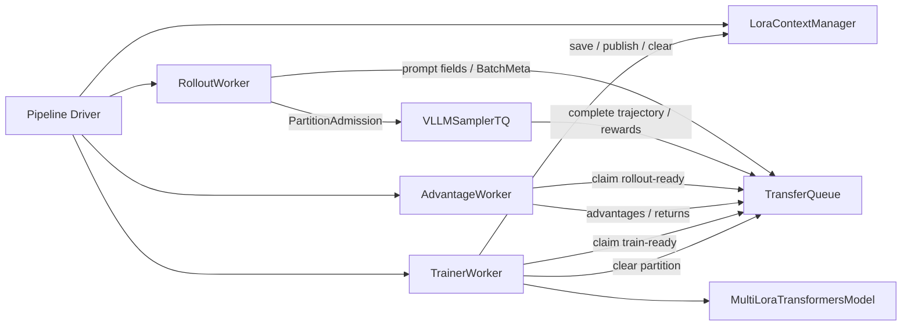
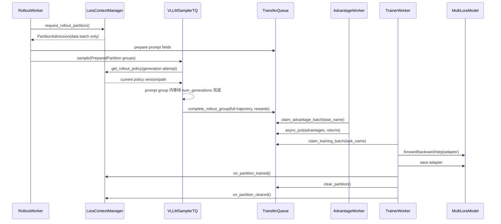

# Async Multi-LoRA RL

## 架构

```text
AsyncMultiLoraGRPOPipeline (driver)
  |- LoraContextManager       CPU Ray actor: policy / partition admission
  |- RolloutWorker            CPU Ray actor: prompt batch -> sampler submission
  |- VLLMSamplerTQ            GPU Ray actor: rollout fields -> TQ
  |- AdvantageWorker          CPU Ray actor: rewards -> advantages / returns
  |- TrainerWorker            CPU Ray actor: TQ batch -> shared MultiLoRA model
  `- MultiLoraTransformersModel GPU Ray actor
```



`TQDataPlane` 是唯一操作原生 TransferQueue `BatchMeta`、`task_name`、
`async_get_meta`、`async_get_data`、`async_put` 的边界。worker 只使用
`PartitionAdmission`、`PreparedPartition`、`ClaimedBatch`，不查看 TQ 元数据细节，
也不调用 `kv_list`。

## 分区窗口

partition 只表示一批训练数据，不绑定 `RolloutPolicy`。每个 generation 在真正
开始生成或重试时从 `LoraContextManager` 获取当前 policy；同一个 prompt group 和
partition 都可以包含多个 policy version。准入统一使用：

```python
oldest_unreleased_step = min(live_steps) if live_steps else next_partition_step
can_open = next_partition_step - oldest_unreleased_step <= max_staleness
```

因此 `max_staleness=0` 自然只允许一个 live partition；更大的值允许 rollout
相对最早的未释放 partition 最多领先对应 step 数。只有完成
`save adapter -> publish policy -> clear TQ -> on_partition_cleared` 后，容量才释放。

## 时序



Rollout、advantage、train 三个 actor 都是独立长期运行的服务。driver 只调用一次
`start()`，随后只检查 worker health、drain metrics 和停止服务；它不直接调用任何
rollout、advantage 或 train 阶段循环。worker 之间不通过 callback 或内存 ready queue
通信。某个 context 暂无完整 group 时，阶段 scheduler 立即尝试另一个 context。

`allow_partial_rollout=false` 时，被中断的 generation 丢弃部分输出，并在重试时使用
当前 policy 从原 prompt 重新生成；其他已经完成的 generation 保留。
`allow_partial_rollout=true` 时保留中断前生成的 token，再使用当前 policy 继续生成。
sample tag 记录实际的 initial/final policy version 和 version span。两种模式都只在
`num_generations` 全部完成后将整个 prompt group 标记为 rollout-ready。

partition 只描述正常数据生命周期：`ROLLOUT -> TRAINING -> PUBLISHED -> clear`，
没有 `FAILED` 状态。当前版本不提供阶段级恢复或部分 partition 接管；prompt 加载、
rollout、advantage、train 任一服务异常都会由 driver 提升为 `run_failed` 并终止运行。
失败时保留 TQ 中的现场数据，不伪装成已经完成清理的 partition。

## Context 调度

每个 worker 自己持有 `ContextScheduler`，三个阶段独立调度：

```yaml
scheduler:
  rollout: {policy: round_robin, max_consecutive_units: 1}
  advantage: {policy: oldest_partition, max_consecutive_units: 1}
  train: {policy: sticky, max_consecutive_units: null}
```

`round_robin` 保证 rollout 公平；`sticky` 在当前 context 仍有完整 batch 时持续
训练，避免无谓 adapter 切换；`oldest_partition` 优先最早创建的 live partition。

每个 context 独立配置各阶段 batch：

```yaml
rollout:
  batch_size: 8          # 一个 partition 的 prompt group 数
  num_generations: 4
advantage:
  groups_per_batch: 2   # 一次 advantage 消费的完整 group 数
train:
  groups_per_batch: 2   # 一个 optimizer step 的完整 group 数
  micro_batch_size: 1   # 每个 model DP rank 的 forward/backward 粒度
```

一个 optimizer step 的全局 trajectory 数为
`train.groups_per_batch * rollout.num_generations`。启动时校验 partition 可以被
advantage/train group batch 完整消费，rollout group 数可以被 sampler DP 均匀分片，
训练 trajectory 数可以被 model DP 均匀分片。

## 指标

worker 只缓冲业务事件，driver 定期 `drain_metrics()` 后通过
`JSONLMetricsRecorder` 写入单一 JSONL。事件包括 `rollout_submitted`、
`rollout_done/failed`、`advantage_done`、`train_step_done`、`partition_done`、
`policy_published` 与 `run_completed`。不记录 TQ 操作事件和 `pipeline_step`。

`rollout_done` 记录 group latency、output tokens/second、completion length、retry、
abort 和 partial resume 数量。`train_step_done` 记录 sample 相对当前训练 policy 的
version gap，以及 partial rollout 的 policy version span。

JSONL 可以用 `scripts/async_rl/jsonl_to_swanlab.py` 重放到本地 SwanLab。

## 本地回归

安装真实 async RL 运行依赖：

```bash
pip install -e '.[async-rl]'
```

```bash
PYTHONPATH=src python scripts/async_rl/native_tq_e2e.py \
  --config cookbook/rl/async_native_multi_lora_grpo.yaml
```

fake 回归覆盖两个 context、group 对齐消费、advantage/train 链路、partition clear，
以及非恒定 reward/loss 指标。
