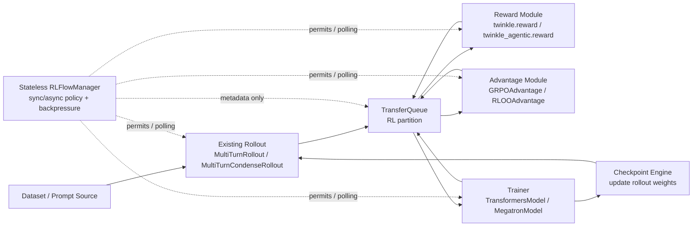
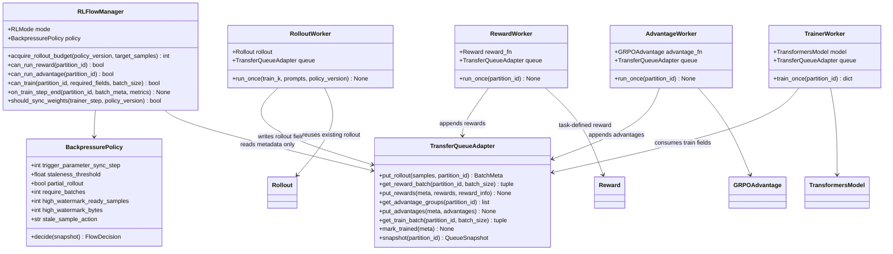
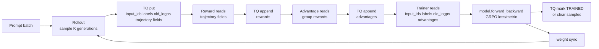
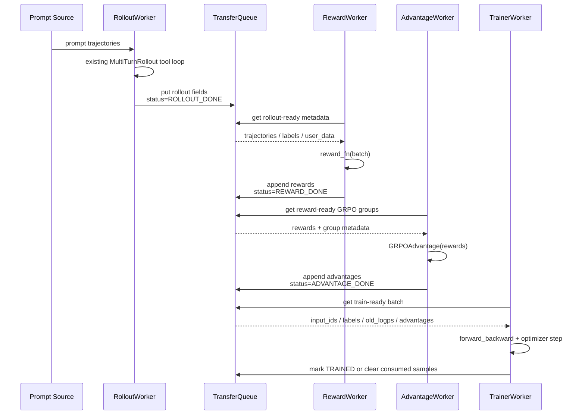
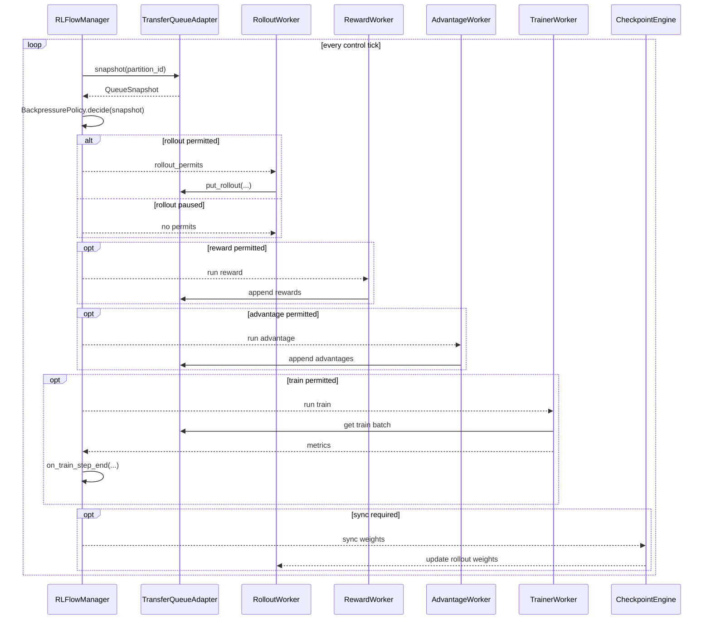
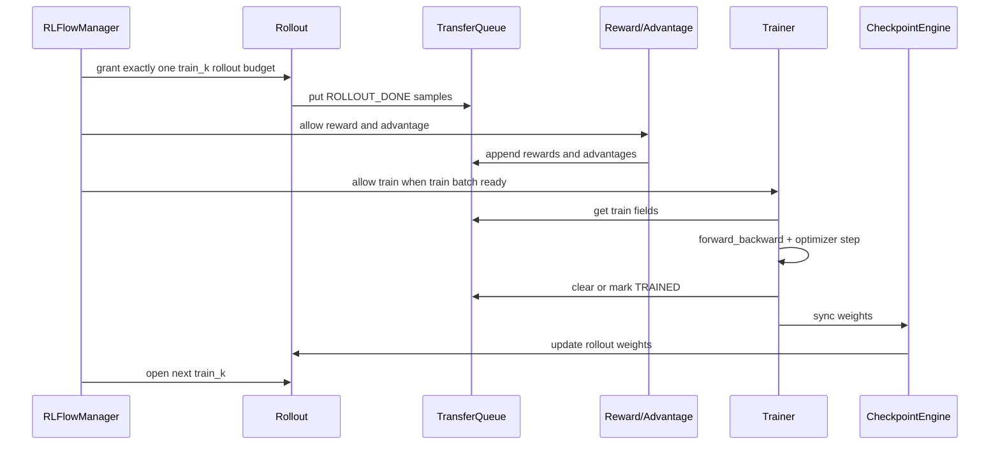

# TransferQueue-based Agentic RL Spec

## Background

Twinkle already has the main building blocks required by agentic RL:

- `MultiTurnRollout` / `MultiTurnCondenseRollout` generate multi-turn trajectories and handle tool interaction through `ToolManager`.
- `Reward` and task-specific reward modules score completed trajectories.
- `GRPOAdvantage` computes group-relative advantages from rewards.
- `TransformersModel` / `MegatronModel` consume encoded training samples through `forward_backward`.
- `GRPOMetric` and `GRPOLoss` consume `old_logps` and `advantages`.
- Checkpoint engines synchronize trainer weights back to rollout workers.

The missing part is not a new rollout implementation. The missing part is a data-plane boundary between rollout and trainer. Today, RL examples usually pass rollout results, rewards, advantages, and train batches in the same driver loop. This couples rollout latency, reward latency, and trainer latency.

This spec introduces TransferQueue as the data container that decouples rollout-side production from trainer-side consumption. The same data path must support synchronous RL and asynchronous RL. The difference between sync and async is controlled by a stateless flow manager and its backpressure policy, not by changing the rollout class.

## Goals

- Use TransferQueue as the shared data container between rollout, reward, advantage, and trainer.
- Keep existing rollout implementations unchanged at the interaction level.
- Keep task customization in existing task modules: rollout/tool flow, env/tool handling, reward, and advantage.
- Support both synchronous and asynchronous RL through one data-plane API.
- Make backpressure explicit and configurable.
- Allow GRPO to be implemented as a concrete first target.

## Non-goals

- TransferQueue is not an RL scheduler.
- TransferQueue is not an environment abstraction.
- TransferQueue does not own reward computation, advantage computation, or weight synchronization.
- This design does not require `AsyncMultiTurnRollout`.
- This design does not require changing `MultiTurnRollout` tool semantics.

## Core Principle

TransferQueue is only a data container.

It stores samples and fields. Producers append fields. Consumers retrieve fields. It should not decide whether the system is synchronous or asynchronous.

The control policy lives in a stateless manager:

- In synchronous RL, the manager imposes barriers between rollout, reward, advantage, train, and weight sync.
- In asynchronous RL, the manager allows rollout and trainer to run in parallel within bounded lag and memory limits.

The data schema remains the same in both modes.

## Component Overview



## Class Design

The design adds adapters and a flow manager around existing Twinkle components. It does not introduce a new rollout algorithm.



`TransferQueueAdapter` is a Twinkle-side facade. It hides whether the implementation uses TransferQueue native `put/get_meta/get_data`, KV APIs, or `StreamingDataset`. This keeps algorithm code independent from TransferQueue API details.

`RLFlowManager` is stateless in the sample-payload sense. It can keep small runtime counters such as current `train_k`, current `policy_version`, and last sync step, but it must not own sample rows or replay-buffer state. Sample readiness and production/consumption state remain in TransferQueue.

## TransferQueue Usage

Use one logical RL partition per training window:

```text
partition_id = "rl/train/{train_k}"
```

`train_k` is a logical training window. In synchronous mode it usually maps to one rollout-train iteration. In asynchronous mode it maps to a rolling window or policy version range.

Each completed trajectory is one sample row. New stages append new fields to the same row. This relies on TransferQueue dynamic column expansion.

Recommended sample key:

```text
sample_key = "{train_k}:{prompt_uid}:{generation_idx}"
```

Recommended tags:

```python
{
    "train_k": int,
    "prompt_uid": str,
    "group_id": str,
    "generation_idx": int,
    "policy_version": int,
    "status": str,
    "created_at": float,
    "updated_at": float,
    "retry_count": int,
}
```

Recommended statuses:

```text
ROLLOUT_DONE
REWARD_DONE
ADVANTAGE_DONE
TRAINING
TRAINED
DROPPED
FAILED
```

For high-throughput tensor data, use the native `put/get_meta/get_data` path. For fine-grained status updates and partial sample updates, use the KV API (`kv_batch_put`, `kv_batch_get`, `kv_list`, `kv_clear`) if it fits the backend. The implementation can hide this choice behind a Twinkle adapter.

## Data Schema

Rollout writes:

```text
input_ids
attention_mask
labels
loss_scale or completion_mask, optional
old_logps
messages, optional
tool_trace, optional
turns
stop_reason
truncated
user_data or custom_meta
```

Reward appends:

```text
rewards
reward_components, optional
reward_info, optional
```

Advantage appends:

```text
advantages
returns, optional
```

Reference/policy forward workers can append, if the algorithm requires them:

```text
ref_logps
policy_logps
values
```

Trainer consumes at minimum for GRPO:

```text
input_ids
attention_mask
labels
old_logps
advantages
```

`messages`, `tool_trace`, and other large non-tensor objects should be stored only when needed for audit/debug/reward. Small routing metadata should stay in tags or `BatchMeta.custom_meta`.

## GRPO Data Flow



Detailed sequence:

1. The manager grants rollout budget for `train_k`.
2. The existing rollout worker receives prompt trajectories from the dataset.
3. `MultiTurnRollout` or `MultiTurnCondenseRollout` runs the existing multi-turn/tool loop.
4. The rollout worker writes one completed trajectory per sample into TransferQueue with `status=ROLLOUT_DONE`.
5. The reward worker reads samples whose rollout fields are ready, computes task rewards, and appends `rewards`.
6. The advantage worker waits until a GRPO group has all `num_generations` rewards. It computes advantages and appends `advantages`.
7. The trainer reads samples with all required training fields and calls `forward_backward`.
8. After optimizer step, the trainer marks samples as `TRAINED` or clears them from the partition.
9. Weight synchronization remains handled by checkpoint engines. TransferQueue only stores `policy_version` metadata and training data.

## Data-plane Sequence

The data plane is the path of sample payloads. It is identical in sync and async modes.



The key rule is that each stage appends fields to the same sample rows. No stage should pass large batches directly to another stage through Python variables in the target design.

## When Each Component Touches TransferQueue

Rollout touches TransferQueue only after a trajectory is complete.

It should not write every agent turn by default. Per-turn writes are optional observability data and should be disabled in the hot path.

Reward touches TransferQueue after rollout completion:

```python
meta = tq_client.get_meta(
    data_fields=["messages", "input_ids", "labels", "user_data"],
    batch_size=reward_batch_size,
    partition_id=partition_id,
    task_name="reward",
)
batch = tq_client.get_data(meta)
rewards = reward_fn(batch)
reward_data = TensorDict(
    {"rewards": torch.tensor(rewards, dtype=torch.float32)},
    batch_size=len(rewards),
)
tq_client.put(data=reward_data, metadata=meta)
```

Advantage touches TransferQueue after reward completion. For GRPO, it must group by `group_id` or by `(prompt_uid, train_k)` and wait for `num_generations` samples.

Trainer touches TransferQueue only for train-ready samples:

```python
meta = tq_client.get_meta(
    data_fields=["input_ids", "attention_mask", "labels", "old_logps", "advantages"],
    batch_size=global_train_batch_size,
    partition_id=partition_id,
    task_name="trainer",
)
batch = tq_client.get_data(meta)
train_inputs = {
    "input_ids": batch["input_ids"],
    "attention_mask": batch["attention_mask"],
    "labels": batch["labels"],
}
model.forward_backward(
    inputs=train_inputs,
    old_logps=batch["old_logps"],
    advantages=batch["advantages"],
)
model.clip_grad_and_step()
rl_tq.mark_trained(meta)
```

The exact API may be wrapped by Twinkle, but the stage ownership should remain this way.

## Stateless Flow Manager

The manager decides how much each component may produce or consume. It does not store sample payloads and does not become a replay buffer.

Proposed interface:

```python
class RLFlowManager:
    def acquire_rollout_budget(self, *, policy_version: int, target_samples: int) -> int:
        ...

    def can_run_reward(self, *, partition_id: str) -> bool:
        ...

    def can_run_advantage(self, *, partition_id: str) -> bool:
        ...

    def can_train(self, *, partition_id: str, required_fields: list[str], batch_size: int) -> bool:
        ...

    def on_train_step_end(self, *, partition_id: str, batch_meta, metrics: dict) -> None:
        ...

    def should_sync_weights(self, *, trainer_step: int, policy_version: int) -> bool:
        ...
```

The manager reads only TransferQueue metadata, tags, counters, and trainer/rollout progress signals.

### Manager Snapshot

The manager evaluates a lightweight snapshot:

```python
@dataclass
class QueueSnapshot:
    partition_id: str
    rollout_done: int
    reward_done: int
    advantage_done: int
    training: int
    trained: int
    failed: int
    estimated_bytes: int
    min_policy_version: int | None
    max_policy_version: int | None


@dataclass
class FlowDecision:
    rollout_permits: int
    run_reward: bool
    run_advantage: bool
    run_train: bool
    sync_weights: bool
    stale_action: str | None
```

`QueueSnapshot` can be built from TransferQueue metadata and tags. `FlowDecision` is consumed by workers or by the driver loop. The manager never mutates payloads directly; workers perform the actual `put/get/mark` operations.

### Control-flow Sequence

The control plane decides when components are allowed to run.



Sync mode and async mode use the same control loop. Sync mode returns conservative decisions with barriers. Async mode returns rolling permits based on `trigger_parameter_sync_step`, `staleness_threshold`, and `partial_rollout`.

## Sync Mode

Synchronous RL uses the same TransferQueue data path but enforces barriers.



Sync-mode policy:

```text
trigger_parameter_sync_step = 1
staleness_threshold = 0
partial_rollout = false
rollout_window = one train_k
next_rollout waits for TRAINED + weight sync
```

This mode preserves current on-policy semantics while replacing in-memory handoff with TransferQueue.

## Control Modes

The manager uses three core parameters to describe both sync and async behavior:

```text
trigger_parameter_sync_step
staleness_threshold
partial_rollout
```

These parameters define the RL semantics more directly than a loose collection of watermarks. TransferQueue watermarks still exist, but only as capacity protection; they do not define the training mode.

`staleness_threshold` may be fractional. A value between `0` and `1` allows limited stale samples without opening a full extra rollout window.

The manager derives rollout budget from the trainer batch shape:

```text
base_rollout_budget = trigger_parameter_sync_step * require_batches * train_mini_batch_size

if staleness_threshold == 0:
    max_rollout_budget = base_rollout_budget
else:
    max_rollout_budget = (1 + staleness_threshold) * base_rollout_budget - stale_samples_from_last_window
```

In Twinkle GRPO, `train_mini_batch_size` should map to the number of completed rollout samples required by one trainer update. `require_batches` is a streaming-granularity knob and should default to `1`.

| Mode | `trigger_parameter_sync_step` | `staleness_threshold` | `partial_rollout` | Semantics |
| --- | ---: | ---: | --- | --- |
| on-policy pipeline | `1` | `0` | ignored | Closest to current synchronous on-policy training |
| stream off-policy pipeline | `>1` | `0` | ignored | One rollout parameter version serves multiple trainer updates |
| async stream with stale samples | `>=1` | `>0` | `False` | Rollout and trainer run concurrently; stale samples are allowed; active rollouts finish before sync |
| async stream with partial rollout | `>=1` | `>0` | `True` | Rollout and trainer run concurrently; stale samples are allowed; active rollouts may be interrupted and resumed |

`partial_rollout` only takes effect when `staleness_threshold > 0`. When `staleness_threshold = 0`, the manager should not interrupt active rollouts.

### on-policy pipeline

Condition:

```text
trigger_parameter_sync_step = 1
staleness_threshold = 0
```

Flow:

```text
Rollout generates one batch
Reward/Advantage fills training fields
Trainer trains that batch
Trainer syncs parameters to Rollout
Next iteration starts
```

This mode has no stale samples and no partial rollout. It preserves strict on-policy semantics while replacing in-memory handoff with TransferQueue.

### stream off-policy pipeline

Condition:

```text
trigger_parameter_sync_step > 1
staleness_threshold = 0
```

Flow:

```text
Rollout generates enough samples for trigger_parameter_sync_step trainer updates
Trainer trains whenever one train batch is ready
Trainer syncs parameters after trigger_parameter_sync_step updates
Next rollout window starts
```

`staleness_threshold=0`, so the trainer does not consume samples across rollout parameter versions. It is still stream off-policy because the same rollout parameter version supports multiple trainer updates.

### async stream with stale samples

Condition:

```text
trigger_parameter_sync_step >= 1
staleness_threshold > 0
partial_rollout = False
```

Flow:

```text
Rollout keeps producing samples
Trainer keeps consuming train-ready samples
Trainer triggers parameter sync after trigger_parameter_sync_step updates
If Rollout has active tasks, sync waits for those tasks to finish
Trainer may consume samples whose policy lag is within staleness_threshold
```

This mode introduces stale samples without interrupting active rollouts. It is suitable when rollout latency is stable or when environment interaction should not be interrupted.

### async stream with partial rollout

Condition:

```text
trigger_parameter_sync_step >= 1
staleness_threshold > 0
partial_rollout = True
```

Flow:

```text
Rollout keeps producing samples
Trainer keeps consuming train-ready samples
Trainer triggers parameter sync after trigger_parameter_sync_step updates
If Rollout has active tasks, the manager may request interruption
After syncing new parameters, Rollout resumes unfinished samples
Trainer may consume samples whose policy lag is within staleness_threshold
```

This is the most asynchronous mode. It reduces the time spent waiting for long-tail rollouts during parameter sync, but it requires rollout-side save/resume support for unfinished agent state. For the current `MultiTurnRollout`, the first implementation can define the interface without requiring partial resume support.

### Trainable Sample Condition

The trainer only consumes samples satisfying:

```text
sample.status == ADVANTAGE_DONE
required train fields are ready
trainer_policy_version - sample.policy_version <= staleness_threshold
```

When `staleness_threshold = 0`, the trainer only consumes samples allowed by the current rollout window.

## Backpressure Strategy

Backpressure has two layers:

1. RL semantic layer: defined by `trigger_parameter_sync_step`, `staleness_threshold`, and `partial_rollout`.
2. TransferQueue capacity layer: defined by ready sample count, partition bytes, and worker backlog; it only prevents memory/storage runaway.

Capacity-layer inputs:

- number of `ROLLOUT_DONE`, `REWARD_DONE`, `ADVANTAGE_DONE`, `TRAINING` samples
- partition estimated bytes
- number of active rollout tasks
- number of ready-to-train batches
- trainer throughput

Capacity-layer outputs:

- rollout permit count
- reward/advantage permit
- train permit
- stale sample action
- partial rollout interrupt request
- weight sync decision

Default capacity protection:

```text
if tq_bytes >= high_watermark_bytes:
    pause rollout permits

if ready_to_train >= high_watermark_ready_samples:
    pause rollout permits

otherwise:
    allow rollout permits

if no train-ready batch exists:
    keep trainer polling

if trainer_policy_version - sample.policy_version > staleness_threshold:
    mark sample DROPPED

if sync is due and partial_rollout is True:
    request rollout interruption

if sync is due and partial_rollout is False:
    wait active rollout tasks finish
```

The manager can be implemented as a simple polling loop. It does not need to own persistent sample state because TransferQueue already owns production and consumption state.

## Failure Handling

Rollout failure:

- mark sample `FAILED`
- keep prompt metadata for retry
- retry only if `retry_count < max_retries`

Reward failure:

- append `reward_info.error`
- mark sample `FAILED` or assign configured fallback reward

Advantage failure:

- usually indicates incomplete GRPO group
- keep samples pending until group timeout
- after timeout, drop incomplete group or compute fallback batch-level advantage

Trainer failure:

- do not clear samples until optimizer step succeeds
- if a train batch fails before step, release or retry the metadata
- if a step succeeds but clear fails, tags must be idempotent

## Initial Implementation Plan

Phase 1: synchronous data-plane replacement.

- Add a Twinkle TransferQueue adapter.
- Keep one driver process.
- Replace Python-list handoff in GRPO examples with TransferQueue writes and reads.
- Preserve existing rollout, reward, advantage, and trainer calls.

Phase 2: asynchronous workers.

- Run rollout, reward, advantage, and trainer as independent workers.
- Add stateless manager based on `trigger_parameter_sync_step`, `staleness_threshold`, and `partial_rollout`.
- Add policy-version and stale-sample handling.

Phase 3: streaming trainer input.

- Integrate TransferQueue `StreamingDataset` / `StreamingDataLoader` for trainer consumption.
- Use rank-aware sampling for DP groups.
- Keep rollout-side production unchanged.

## Configuration Sketch

```yaml
rl:
  mode: sync  # sync | async
  algorithm: grpo
  num_generations: 8
  partition_prefix: rl/train

transfer_queue:
  backend: SimpleStorage
  polling_mode: true
  pre_alloc_sample_num: 1024

flow_manager:
  trigger_parameter_sync_step: 1
  staleness_threshold: 0
  partial_rollout: false
  require_batches: 1
  high_watermark_ready_samples: 512
  high_watermark_bytes: 64GB
  stale_sample_action: drop

rollout:
  class: MultiTurnRollout
  max_turns: 6
  max_trajectory_tokens: 8192

trainer:
  required_fields:
    - input_ids
    - attention_mask
    - labels
    - old_logps
    - advantages
```

Recommended mode settings:

```text
on-policy:
  trigger_parameter_sync_step = 1
  staleness_threshold = 0

stream off-policy:
  trigger_parameter_sync_step > 1
  staleness_threshold = 0

async stale:
  trigger_parameter_sync_step >= 1
  staleness_threshold > 0
  partial_rollout = false

async partial:
  trigger_parameter_sync_step >= 1
  staleness_threshold > 0
  partial_rollout = true
```

## Open Questions

- Whether Twinkle should use TransferQueue native `put/get_meta/get_data` or KV API for partial field updates in the first implementation.
- Whether `messages` should be stored as a TransferQueue non-tensor field or moved entirely into `custom_meta` / trace files.
- Whether stale samples should be dropped, down-weighted, or trained with explicit importance correction.
- Whether current `MultiTurnRollout` needs an interrupt/resume agent-state interface for `partial_rollout=True`.
- How to expose TransferQueue metrics in existing Twinkle logging.
