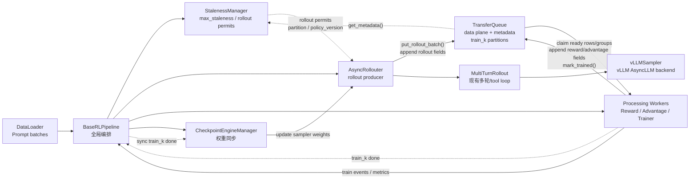
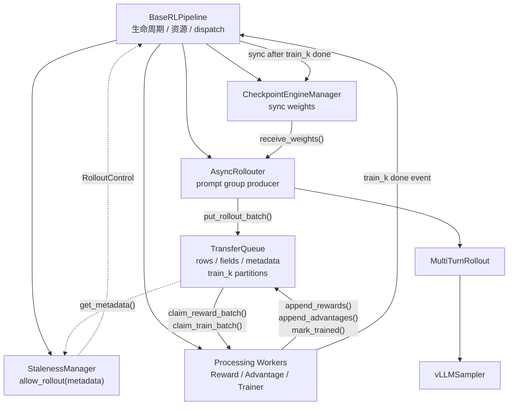
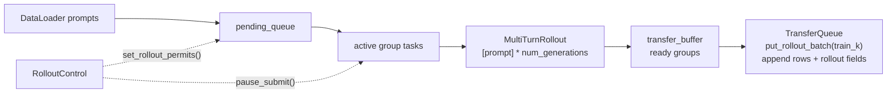
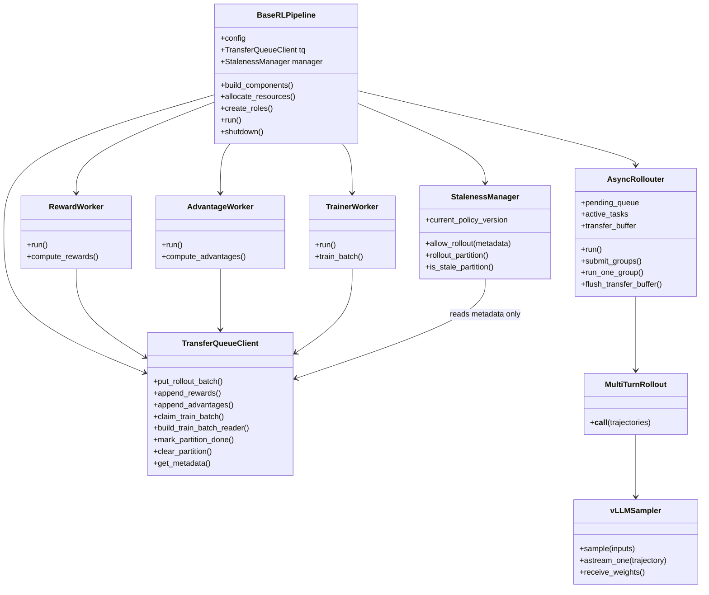
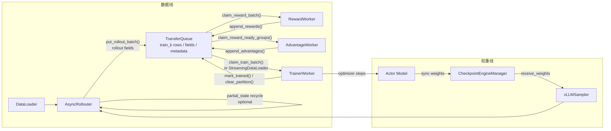
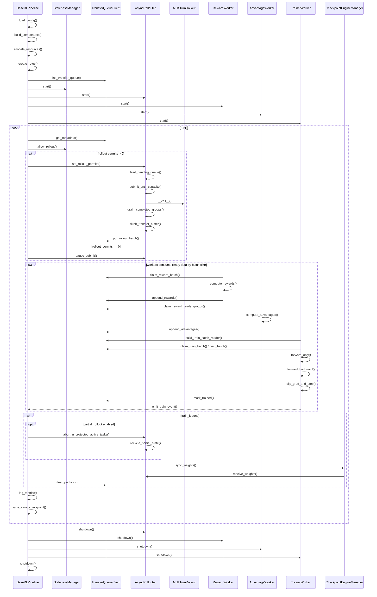

# 基于 TransferQueue 的 Agentic RL Fully Async 设计规格

## 目标

本规格定义 Twinkle 在 agentic 多轮 RL 中接入 TransferQueue 的目标架构。设计重点不是新增一个 `AsyncMultiTurnRollout`，而是把 TransferQueue 作为 rollout、reward、advantage、trainer 之间的统一数据协议层，在现有 `MultiTurnRollout`、`vLLMSampler`、reward、advantage、trainer 之外增加异步生产、流式消费和版本控制编排：

```text
BaseRLPipeline 负责整个 RL 生命周期编排。
AsyncRollouter 负责 rollout 数据生产侧。
TransferQueue 作为数据面和 metadata 控制面的统一媒介。
StalenessManager 负责 staleness 判断和 rollout 提交控制。
RewardWorker、AdvantageWorker、TrainerWorker 从 TransferQueue 消费数据并追加 reward、advantage、trained 状态。
```

第一版落地目标是 GRPO。设计以当前 `cookbook/exp/grpo_baseline.py` 的同步流程为基线，但把内存中的 `all_trajectories / rewards / advantages / old_logps` handoff 改为 TransferQueue 中的 partition、field、metadata 和 sampler/claim 语义，并让 rollout 和 trainer 可以重叠执行。

## 当前基线

`grpo_baseline.py` 的核心流程是同步 batch-blocking：

```python
expand_prompts = [p for prompt in batch for p in [prompt] * NUM_GENERATIONS]

ckpt_manager.sync_weights(merge_and_sync=False)
sampler.reset_prefix_cache()

all_trajectories = rollout(expand_prompts)
total_rewards, f1_rewards, cot_rewards = compute_rewards(all_trajectories)
advantages = GRPOAdvantage()(total_rewards, num_generations=NUM_GENERATIONS, scale="group")

for mini_batch in all_trajectories:
    ref_logps = model.forward_only(..., disable_lora=True)
    model.forward_backward(
        inputs=mini_batch,
        old_logps=old_logps,
        advantages=advantages,
        ref_logps=ref_logps,
    )
    model.clip_grad_and_step()
```

这个流程有三个问题：

- `rollout(expand_prompts)` 要等整个 expanded batch 完成后才返回，快完成的 prompt group 不能提前进入训练数据系统。
- rollout、reward、advantage、trainer 在同一个 driver loop 中串行运行，无法自然 overlap。
- 权重同步、staleness、长尾任务取消等控制逻辑没有独立抽象，难以切换同步/异步模式。

## 核心概念

### Prompt Group

GRPO 的最小语义单元不是单条 trajectory，而是一个 prompt 的多条 generation：

```text
prompt_i
  -> NUM_GENERATIONS 条 trajectories
  -> 一个 prompt group
```

原因是 `GRPOAdvantage` 需要按 group 计算 relative advantage。第一版 fully async 的 rollout 调度单位应是 prompt group，而不是单条 trajectory。

### Transfer Batch

Rollout 不应等完整 rollout step 所有 group 就绪后才写入 TransferQueue，也不应每条 sample 写一次。

推荐写入粒度是 transfer batch：

```text
若干 ready prompt groups
  -> batch_to_transfer
  -> flatten 成 samples
  -> put 到同一个 train_k partition
```

这样可以把长尾影响范围从完整 rollout step 缩小到 prompt group。

### Partition

TransferQueue partition 是数据生命周期和权重版本同步单位：

```text
partition_id = train_{rollout_id}
```

一个 `train_k` 可以被多次 append。rollout side 按 transfer batch 往 `train_k` 追加 ready groups；trainer side 从 `train_k` 持续读取字段 ready 的 samples。`train_k` 达到目标样本量并训练完成后，触发权重同步并清理 partition。

### TransferQueue 数据协议

TransferQueue 在本设计中不是普通 FIFO，也不是 `list[Trajectory]` 的远端替代品。所有跨阶段数据交换必须落到以下协议上：

```text
partition:
  train_k 作为 rollout step、policy version 和生命周期边界

row:
  sample / trajectory 作为 TQ 中的一行

field:
  rollout、reward、advantage、train 状态按阶段追加

metadata:
  记录 field ready、消费状态、partition 进度、policy version、存储占用

sampler / claim:
  控制不同阶段如何选择 ready rows，避免重复消费并保持 GRPO group 完整
```

因此 `BaseRLPipeline` 不再在内存里传递大对象；`AsyncRollouter`、reward、advantage、trainer 都只通过 `TransferQueueClient` 读写 TQ。

### Policy Version

`policy_version` 表示 rollout 使用的参数版本。第一版建议令：

```text
policy_version = 当前 trainer 已同步给 sampler 的参数版本
```

每个 trajectory 必须记录：

```text
rollout_id
partition_id
group_id
generation_idx
policy_version
```

trainer 根据 `current_policy_version - partition.policy_version` 判断 staleness。第一版不做 sample-level staleness filtering。

## 总体架构



组件边界：

- `BaseRLPipeline`：训练入口和总编排，负责组件初始化、资源分配、角色创建、worker 启停、日志、checkpoint、异常处理。
- `AsyncRollouter`：只负责 rollout 数据生产侧，不负责 reward、advantage、loss、optimizer。
- `TransferQueue`：承载 sample row、stage fields、partition metadata、消费状态和存储生命周期；它不决定同步还是异步，但所有调度决策都以它的 metadata 为输入。
- `TransferQueueClient`：Twinkle 侧封装，屏蔽 TransferQueue native API、KV API、StreamingDataLoader 的具体差异。
- `StalenessManager`：staleness 控制核心。它只根据 TransferQueue metadata 和少量版本计数判断当前 rollout 是否可以继续提交、应写入哪个 partition，不持有 sample payload，也不控制权重同步。
- `RewardWorker / AdvantageWorker / TrainerWorker`：分别处理 reward、advantage、train 三个阶段；第一版可以独立实现，也可以先在同一个进程中顺序运行。
- `CheckpointEngineManager`：复用现有 trainer -> sampler 权重同步路径。

## 组件架构图

### 组件分层



这张图只表达组件分层和边界：`BaseRLPipeline` 驱动流程，`StalenessManager` 只做 staleness 和 rollout 提交判断，`TransferQueue` 承载 row/field/metadata/partition 生命周期，具体 reward、advantage、train 阶段可以是独立 worker，也可以先由同一个进程顺序执行。

### AsyncRollouter 内部结构



`AsyncRollouter` 的核心状态是 `pending_queue`、`active_tasks` 和 `transfer_buffer`。它按 prompt group 生产数据，group 完成后先进入 transfer buffer，达到 `transfer_batch_size_groups` 后追加到当前 `train_k`。

## 类关系



## AsyncRollouter

`AsyncRollouter` 是 rollout side 的异步生产运行时。它不是整个 RL pipeline，也不负责训练。它存在的原因是当前接口：

```python
all_trajectories = rollout(expand_prompts)
```

是 batch-blocking。要实现 fully async，需要把数据生产改成：

```text
DataLoader prompts
  -> pending_queue
  -> active prompt group tasks
  -> ready group transfer_buffer
  -> TransferQueue train_k
```

### 内部状态

```python
@dataclass
class RolloutGroupRequest:
    prompt: Trajectory
    rollout_id: int
    partition_id: str
    group_id: str
    num_generations: int
    policy_version: int
    partial_state: dict | None = None
    abort_count: int = 0
    protected: bool = False


@dataclass
class RolloutGroupResult:
    request: RolloutGroupRequest
    trajectories: list[Trajectory]
    status: str  # ok / timeout / aborted / failed
    partial_state: dict | None = None
    error: str | None = None
```

`AsyncRollouter` 持有：

```text
pending_queue: asyncio.Queue[RolloutGroupRequest]
active_tasks: set[asyncio.Task]
transfer_buffer: list[list[Trajectory]]
queue_size
concurrency
transfer_batch_size_groups
group_timeout_s
partial_rollout_enabled
partial_rollout_max_aborted_count
mask_offpolicy_in_partial_rollout
```

### 运行逻辑

```python
class AsyncRollouter:
    async def run(self):
        while not self.stopped:
            await self.feed_pending_queue()
            await self.submit_until_capacity()
            await self.drain_completed_groups()
            await self.flush_if_ready()
            await self.apply_manager_backpressure()

    async def run_one_group(self, request: RolloutGroupRequest) -> RolloutGroupResult:
        group_inputs = [request.prompt] * request.num_generations
        if request.partial_state is not None:
            group_inputs = self.restore_partial_inputs(group_inputs, request.partial_state)
        trajectories = await self.call_rollout(group_inputs)
        for generation_idx, traj in enumerate(trajectories):
            traj["partition_id"] = request.partition_id
            traj["rollout_id"] = request.rollout_id
            traj["group_id"] = request.group_id
            traj["generation_idx"] = generation_idx
            traj["policy_version"] = request.policy_version
            self.apply_partial_loss_mask(traj, request)
        return RolloutGroupResult(request=request, trajectories=trajectories, status="ok")
```

第一版可以复用现有 `MultiTurnRollout`：

```text
一个 group task 调用一次:
  rollout([prompt] * NUM_GENERATIONS)
```

这样 group 内部仍然复用 `MultiTurnRollout` 的 batched sampler 调用；group 之间由 `AsyncRollouter` 做并发。

后续如果要更接近 verl，可把 `MultiTurnRollout` 内部局部状态拆成可调度的 agent loop state，让同一 group 内的 `NUM_GENERATIONS` 条 trajectory 也以独立 task 并发执行。

### Partial Rollout

`partial_rollout` 是长 response / agentic 多轮任务的可选能力。它解决的问题是：权重同步或背压收缩时，如果直接 abort 正在运行的长尾 rollout，会浪费已经生成的上下文、tool 结果和 response tokens。

第一版可以采用 Relax-style 语义：

```text
partial_rollout.enabled = true
  active rollout task 被 abort 时，不直接丢弃。
  rollouter 保存 partial_state，重新放回 pending_queue。
  后续用新权重从 partial_state 继续生成。

partial_rollout.max_aborted_count = N
  一个 group 最多允许被中断 N 次。
  abort_count >= N 后进入 protected 状态，不再被中断，保证最终完成。

partial_rollout.mask_offpolicy_tokens = true
  旧 policy version 已经生成的 response tokens 作为上下文保留。
  这些 token 的 loss_mask 置 0，不参与 policy loss。
```

这不会改变第一版的版本一致性约束：

```text
完成后的 sample 写入当前 train_k / policy_version
trainer batch 仍然只 claim 同一个 train_k / policy_version
旧版本 token 可以作为上下文
旧版本 token 默认不贡献 loss
新版本续写 token 才参与训练
```

需要保存的 partial state：

```text
prompt / messages
generated_tokens
tool_calls / env_state
turn_state
old_policy_version
offpolicy_token_count
partial_source_policy_version
abort_count
```

当 `BaseRLPipeline` 准备执行 train_k 完成后的权重同步且存在 active rollout tasks 时：

```text
partial_rollout disabled:
  等待 active tasks 完成，或者按普通 timeout/retry 处理。

partial_rollout enabled:
  abort 未 protected 的 active tasks
  将 partial_state 回收到 pending_queue
  同步 sampler 权重
  为 partial request 重新分配当前 rollout_id / partition_id / policy_version
  继续提交 pending_queue 中的 partial requests
```

如果当前 `MultiTurnRollout` 无法导出 token/tool/env 级 partial state，则第一版实现可以先退化为 whole-group retry；但 spec 的接口应保留 `partial_state`、`abort_count`、`protected` 和 `loss_mask` 字段，避免后续重做数据协议。

### 和 vLLMSampler 的关系

当前 `vLLMSampler` 足够作为第一版 fully async 的底层 sampler：

- `sample()` 支持 `List[Trajectory]` / `List[InputFeature]`。
- sampler 内部使用 vLLM `AsyncLLM`，可以并发提交多个请求。
- `SampleResponse` 带 `tokens`、`logprobs`、`decoded`、`new_input_feature`。
- `receive_weights()` 支持 trainer 到 sampler 的权重同步。
- `astream_one()` 可作为后续更细粒度 streaming rollout runtime 的基础。

不足之处在上层 runtime，而不是 sampler 本身。第一版不要求新增 vLLM engine。

## 数据流

数据流不是 Python 对象在各阶段之间传递，而是 TransferQueue 中同一批 rows 的字段逐步 ready：

```text
rollout fields ready
  -> reward fields ready
  -> advantage fields ready
  -> train state ready
  -> clear partition
```

每个阶段只读取自己依赖的字段，只追加自己产出的字段。这样 TQ 的字段级读写、消费状态和 metadata 才能被充分利用。

### 数据线和权重线



### rollout 写入 TQ

一个 rollout step 创建一个 partition：

```text
rollout_id = k
partition_id = train_k
target_groups = partition.target_groups
target_samples_per_partition = partition.target_groups * rollout.num_generations
```

这里的 `partition.target_groups` 表示一个 `train_k` 目标收集多少个 prompt group，不表示 rollouter 一次必须生成多少个 group。rollouter 仍然是 streaming producer，group ready 后分批写入同一个 `train_k`。

`AsyncRollouter` 持续生成 group。每当一个 group 完成：

```text
RolloutGroupResult
  -> optional group filter
  -> transfer_buffer.append(group)
```

当 `transfer_buffer` 达到阈值：

```text
len(transfer_buffer) >= transfer_batch_size_groups
```

则 flatten group 并写入同一个 partition：

```python
tq.put_rollout_batch(
    partition_id=f"train_{rollout_id}",
    samples=flatten(transfer_buffer),
)
```

推荐默认值：

```text
transfer_batch_size_groups =
  train_global_batch_size // num_iters_per_train_update // rollout.num_generations
```

若没有 `num_iters_per_train_update`，默认：

```text
transfer_batch_size_groups =
  train_global_batch_size // rollout.num_generations
```

一次 put 的 sample 数：

```text
transfer_batch_size_samples =
  transfer_batch_size_groups * rollout.num_generations
```

### TQ 字段

rollout 初始写入字段：

```text
input_ids
attention_mask
position_ids
labels
old_logps              # 从 trajectory["logprobs"] 提取
messages
turns
stop_reason
truncated
loss_mask              # partial rollout 时旧版本 token 可置 0
policy_version
rollout_id
partition_id
group_id
generation_idx
partial_rollout
abort_count
offpolicy_token_count
partial_source_policy_version
```

reward 追加字段：

```text
rewards
raw_rewards
reward_breakdown       # 例如 f1/cot/tool 等
```

advantage 追加字段：

```text
advantages
returns                # 如果算法需要
```

trainer 可追加或临时计算：

```text
ref_logps              # KL 开启时可以在 trainer 内计算，也可以拆 RefWorker
train_metrics
```

第一版可以把 `ref_logps` 留在 `TrainerWorker` 内部，复用 `grpo_baseline.py` 的逻辑：

```python
ref_outputs = model.forward_only(inputs=mb_inputs, disable_lora=True)
```

## GRPO 处理

GRPO 的 ready 条件是 group 完整：

```text
同一个 (partition_id, group_id)
  有 NUM_GENERATIONS 条 trajectories
  且每条都有 reward
```

`AdvantageWorker` 读取完整 group：

```python
total_rewards = [sample["rewards"] for sample in group]
advantages = GRPOAdvantage()(
    total_rewards,
    num_generations=NUM_GENERATIONS,
    scale="group",
)
```

然后按 `generation_idx` 写回：

```text
sample_0.advantages = advantages[0]
sample_1.advantages = advantages[1]
...
```

Trainer 不需要知道 reward 如何计算，只需要读取字段 ready 的 samples：

```text
required fields:
  input_ids
  labels
  old_logps
  advantages
```

## 控制流

控制流由 `BaseRLPipeline` 驱动，`StalenessManager` 只负责 rollout 背压和 staleness 判断。`BaseRLPipeline` 负责启动 worker、周期性读取 TransferQueue metadata、调用 `StalenessManager.allow_rollout()` 获取 rollout 提交许可；Reward、Advantage、Trainer 按配置的 batch size 从 TransferQueue claim ready 数据。权重同步不由 `StalenessManager` 决策，而是固定在每个 `train_k` 训练完成后执行一次。



`RolloutControl` 是 manager 对 rollout 侧的输出。它可以是 dataclass，也可以拆成多项 API；关键是 manager 不控制 reward/advantage/train 的 batch 额度，也不控制权重同步。

```python
@dataclass
class RolloutControl:
    rollout_permits: int
    partition_id: str
    policy_version: int
    max_staleness: int
    abort_rollout_tasks: bool = False
```

`BaseRLPipeline` 是总入口，但它的主循环应围绕 `get_metadata()` 和 `allow_rollout()` 展开：

```python
class BaseRLPipeline:
    def run(self):
        self.load_config()
        self.build_components()
        self.allocate_resources()
        self.create_roles()
        self.init_transfer_queue()

        self.manager.start()
        self.rollouter.start()
        self.reward_worker.start()
        self.advantage_worker.start()
        self.trainer_worker.start()

        while not self.should_stop():
            metadata = self.tq.get_metadata()
            rollout_control = self.manager.allow_rollout(
                metadata=metadata,
                policy_version=self.policy_version,
            )
            self.dispatch_rollout(rollout_control)
            self.sync_and_clear_completed_partitions(metadata)
            self.log_metrics(metadata)
            self.handle_failures(metadata)
            self.maybe_save_checkpoint()

        self.shutdown()
```

`dispatch_rollout(rollout_control)` 只负责把 rollout 许可传给 `AsyncRollouter`：

```text
rollout_permits > 0    -> AsyncRollouter 可以继续提交 group task
```

RewardWorker、AdvantageWorker、TrainerWorker 是长期运行的消费者。它们按配置项控制吞吐：

```text
reward.batch_size
advantage.max_groups_per_batch
trainer.train_global_batch_size
```

如果 TQ 中没有 ready 数据，对应 worker 等待或短暂 sleep；不需要 `StalenessManager` 为每个阶段发放调度额度。

## 背压策略

fully async 的背压分三层。

### pending_queue 背压

限制待 rollout 的 prompt group 数：

```python
pending_queue = asyncio.Queue(maxsize=queue_size)
```

`queue_size` 是用户可见参数，表示最多缓存多少个待 rollout 的 prompt group。dataset feeding 太快时，`pending_queue.put()` 会阻塞。

### active_tasks 背压

限制同时运行的 prompt group 数：

```text
concurrency = auto
  由系统根据 rollout replicas 和每个 replica 的建议并发数推导

concurrency = 64
  用户显式指定最多同时运行 64 个 prompt group
```

提交任务前：

```python
max_concurrent_groups = resolve_concurrency(concurrency)

while len(active_tasks) >= max_concurrent_groups:
    done, active_tasks = await asyncio.wait(
        active_tasks,
        return_when=asyncio.FIRST_COMPLETED,
    )
    handle_done(done)
```

### TransferQueue / staleness 背压

限制 rollout 领先 trainer 的数据量和参数版本差距。

按照 Relax-style 第一版设计，只暴露一个用户参数：

```text
max_staleness
```

`max_staleness` 是整数，单位是 `train_k` partition / policy version：

```text
max_staleness = 0
  最多只有当前未完成 train_k；rollout 不领先 trainer。

max_staleness = 1
  rollout 可以比 trainer 多保留 1 个未完成 train_{k+1}。

max_staleness = 2
  rollout 可以再多保留 1 个未完成 train_{k+2}。
```

Manager 内部派生：

```text
max_live_partitions = max_staleness + 1
```

第一版不支持 verl-style 的非整数 stale sample 控制，也不支持 mixed-version train batch。trainer 只能从同一个 `train_k` / 同一个 `policy_version` claim 训练数据。

当满足下面条件时，`StalenessManager.allow_rollout()` 生成的 `RolloutControl.rollout_permits` 应为 `0`：

```text
active_partitions >= max_live_partitions
or tq_bytes >= max_tq_bytes
```

`max_tq_bytes` 是系统保护参数，默认可以不暴露给算法用户。

### 版本一致性

Relax-style 第一版使用 partition-consistent batch：

```text
claim_train_batch(partition_id=train_k)
  -> batch 内所有 samples 来自同一个 train_k
  -> batch 内所有 samples 来自同一个 policy_version
```

这意味着：

```text
policy_version(train_k) = k 对应的 rollout 参数版本
trainer train train_k
trainer sync weights -> policy_version = k + 1
clear train_k
```

如果一个 partition 因为 `max_staleness` 超限而已经不可训练，`StalenessManager.is_stale_partition()` 只负责给出判断；具体 drop 或 clear 由 `BaseRLPipeline` / `TransferQueueClient` 执行。第一版不从多个 partition 混合凑 batch，mixed-version batch 不属于第一版目标。

## 权重同步

权重同步不是 `StalenessManager` 的控制项。第一版固定为每个 rollout step / `train_k` 训练完成后同步一次，rollout 只接收新版本。

第一版推荐策略：

```text
train_k done:
  1. TrainerWorker 完成该 partition 内所有 optimizer steps
  2. BaseRLPipeline 调用 checkpoint engine 同步权重到 sampler
  3. current_policy_version += 1
  4. BaseRLPipeline 调用 TransferQueueClient.clear_partition(train_k)
```

一个 partition 内 optimizer step 数：

```text
num_steps_per_partition =
  target_samples_per_partition // train_global_batch_size
```

第一版不把权重同步频率暴露成独立参数，默认策略固定为：

```text
sync_on_partition_done = true
```

也就是每个 `train_k` 训练完成后同步一次权重。`trigger_parameter_sync_step` 和 mixed-version batch 不属于第一版目标。`partial_rollout` 是可选优化，只影响 rollout 中断和续跑，不改变 trainer batch 的版本一致性。

## 同步与异步模式

同一套 pipeline 通过一个高层 `mode` 切换模式。用户不直接配置 `max_live_partitions`、`sync_on_partition_done` 这类底层参数。

推荐用户可见参数：

```yaml
async_training:
  mode: sync                 # sync / async
  max_staleness: 0           # rollout 最多领先 trainer 几个未完成 train_k
```

默认行为：

| mode | 默认 `max_staleness` | 版本一致性 | 语义 |
|---|---:|---|---|
| `sync` | `0` | partition-consistent | 等当前 `train_k` 完整训练、同步、清理后再进入下一轮 |
| `async` | `1` | partition-consistent | rollout 可以领先 trainer 一个 `train_k`，trainer batch 仍来自单一版本 |

Manager 派生参数：

```text
sync_on_partition_done = true
max_live_partitions = max_staleness + 1
```

### on-policy sync

```yaml
async_training:
  mode: sync
```

语义：

```text
rollout train_k
reward train_k
advantage train_k
trainer train_k
sync weights
clear train_k
进入 train_{k+1}
```

这等价于当前 `grpo_baseline.py` 的严格同步流程，只是数据通过 TQ 传递。

### group-level async

```yaml
async_training:
  mode: async
  max_staleness: 1
```

语义：

```text
多个 prompt group 并发 rollout
ready groups 分批 append 到 train_k
reward/advantage/trainer 持续消费 TQ
trainer 完成 train_k 后同步权重
```

这是第一版推荐 fully async 模式。

## TransferQueue 能力利用原则

本设计不能把 TransferQueue 当作普通 FIFO queue 使用。[TransferQueue 官方文档](https://verl.readthedocs.io/en/latest/data/transfer_queue.html)强调它提供控制面 metadata、数据面分布式存储、字段级读写、partition 隔离、Sampler/StreamingDataLoader 和可插拔 storage backend。Twinkle 的接入应显式利用这些能力。

### 控制面：metadata 驱动调度

TransferQueue 控制面会跟踪样本生产状态、消费状态和各计算任务的消费历史。Twinkle 中对应为：

```text
TransferQueueClient.get_metadata()
  -> QueueMetadata / PartitionMetadata
  -> StalenessManager.allow_rollout()
  -> RolloutControl
```

设计要求：

- `StalenessManager` 只读 metadata，不读 payload。
- rollout、reward、advantage、train 的 ready 状态都应进入 metadata。
- 不同 task 的消费状态应隔离，例如 reward 消费过某条 sample，不影响 trainer 后续消费同一条 sample。
- `RolloutControl` 应根据 metadata 中的 active partition、oldest partition、policy version 和 `max_staleness` 生成。

### 数据面：按字段追加，而不是整行重写

TransferQueue 数据面是 sample 行和 field 列的结构。Twinkle 需要按阶段追加字段：

```text
rollout stage:
  input_ids / labels / old_logps / messages / policy_version / group_id

reward stage:
  rewards / raw_rewards / reward_breakdown

advantage stage:
  advantages / returns

trainer stage:
  trained / dropped / train_metrics
```

设计要求：

- `put_rollout_batch()` 只写 rollout 字段。
- `append_rewards()` 只追加 reward 字段。
- `append_advantages()` 只追加 advantage 字段。
- `mark_trained()` 只更新训练状态。
- trainer claim 数据时只读取需要字段，例如 `input_ids`、`labels`、`old_logps`、`advantages`。

这样可以避免在 driver 内搬运完整 trajectory 列表，也能让 reward、advantage、trainer 并发处理不同 ready 字段。

### Partition：用 train_k 做版本和生命周期隔离

TransferQueue 支持逻辑 partition。Twinkle 第一版使用：

```text
partition_id = train_{rollout_id}
```

设计要求：

- 一个 `train_k` 对应一个 rollout 参数版本。
- 一个 `train_k` 内可以多次 append ready groups。
- trainer batch 只从单个 `train_k` claim，保持 partition-consistent。
- `clear_partition(train_k)` 是释放存储和推进 staleness 的关键动作。

这比一个全局 queue 更适合 Relax-style 权重同步和 `max_staleness` 控制。

### 数据检索：预留 Sampler / StreamingDataLoader 接口

TransferQueue 支持自定义数据检索逻辑和 StreamingDataLoader。Twinkle 第一版可以先由 `TransferQueueClient.claim_*` 封装检索策略，但 trainer 侧要预留 StreamingDataLoader 实现：

```python
class TrainDataSampler:
    def sample(
        self,
        ready_indexes: list[int],
        batch_size: int,
        *,
        partition_id: str,
        num_generations: int,
    ) -> tuple[list[int], list[int]]:
        ...
```

第一版默认策略：

```text
partition-consistent
GRPO group complete
sequential or length-balanced
```

后续可以替换为：

```text
GRPOGroupNSampler
length-balanced sampler
rank-aware sampler
StreamingDataLoader-backed trainer dataloader
```

设计要求：

- `TransferQueueClient.claim_train_batch()` 不应写死具体 sampling 策略。
- `TrainerWorker` 不应感知底层是 `claim_train_batch()` 还是 `StreamingDataLoader`。
- GRPO 默认 claim 单位应保持 group 完整，不能把同一 group 拆坏。
- 是否标记 consumed 应由 claim 逻辑控制，避免同一个 task 重复消费。

推荐抽象：

```python
class TrainBatchReader:
    def next_batch(self) -> dict:
        ...


class ClaimBasedTrainBatchReader(TrainBatchReader):
    """第一版默认实现，内部调用 TransferQueueClient.claim_train_batch()."""


class StreamingTrainBatchReader(TrainBatchReader):
    """可选实现，内部封装 TransferQueue StreamingDataLoader。"""
```

这样第一版可以保持 partition-consistent 和 GRPO group 完整；当 TQ backend 和 sampler 能力满足训练侧需求时，也可以直接把 trainer reader 配成 TQ 原生 StreamingDataLoader。

### API 层选择

Twinkle 的 `TransferQueueClient` 应屏蔽底层 API 差异：

```text
native API:
  高吞吐 tensor payload、metadata-based claim、streaming 调度

KV API:
  字段级 patch、状态标记、debug、轻量 metadata tag

StreamingDataLoader:
  trainer 侧未来可选的 rank-aware streaming 消费接口
```

第一版建议：

- rollout/reward/advantage/train 主路径走 native metadata API。
- debug、状态修复、小字段 patch 可走 KV API。
- 不直接在算法代码里调用底层 TQ API，统一通过 Twinkle `TransferQueueClient`。

### 存储后端可插拔

TransferQueue 数据面支持不同 storage backend。Twinkle spec 不绑定具体后端：

```text
local / CPU memory backend
KV backend
HBM / DRAM / SSD hierarchical backend
RDMA / object-store backend
```

设计要求：

- `TransferQueueClient` 初始化时由 YAML 选择 backend。
- Pipeline、Rollouter、Trainer 不感知 backend 类型。
- 大 tensor 字段和小 metadata 字段可以由 backend 做不同优化。

### 对本 spec 的约束

为了充分利用 TransferQueue，当前设计必须遵守：

```text
1. 不在 BaseRLPipeline 中传递 all_trajectories 大对象。
2. 不用 Python list 作为 rollout/reward/advantage/train 的主数据通道。
3. 不把 TQ 当 FIFO，也不只使用最简单的 put/get。
4. 所有阶段通过 field ready + metadata claim 协作。
5. 所有存储释放都通过 clear_partition(train_k) 完成。
```

## TransferQueueClient 接口

```python
class TransferQueueClient:
    def put_rollout_batch(
        self,
        *,
        partition_id: str,
        samples: list[dict],
    ) -> Metadata:
        ...

    def claim_reward_batch(
        self,
        *,
        partition_id: str,
        max_samples: int,
    ) -> list[dict]:
        ...

    def append_rewards(
        self,
        *,
        metadata: Metadata,
        rewards: dict,
    ) -> None:
        ...

    def claim_reward_ready_groups(
        self,
        *,
        partition_id: str,
        num_generations: int,
        max_groups: int,
    ) -> list[list[dict]]:
        ...

    def append_advantages(
        self,
        *,
        group_metadata: list[Metadata],
        advantages: list[float],
    ) -> None:
        ...

    def claim_train_batch(
        self,
        *,
        partition_id: str,
        required_fields: list[str],
        batch_size: int,
    ) -> list[dict]:
        ...

    def build_train_batch_reader(
        self,
        *,
        partition_id: str,
        required_fields: list[str],
        batch_size: int,
        sampler: TrainDataSampler,
        backend: str = "claim",
    ) -> TrainBatchReader:
        ...

    def mark_trained(self, *, metadata: Metadata) -> None:
        ...

    def clear_partition(self, *, partition_id: str) -> None:
        ...

    def get_metadata(self) -> QueueMetadata:
        ...
```

`TransferQueueClient` 的职责是封装底层 TQ API，不让 pipeline 依赖具体实现。高吞吐 tensor 数据优先走 native `put/get_meta/get_data`；细粒度状态更新可以走 KV API；trainer 侧可以通过 `build_train_batch_reader()` 选择 claim-based reader 或 StreamingDataLoader-backed reader。对上层只暴露 sample/group/partition/batch reader 语义。

控制面 metadata 不包含 trajectory/token/reward payload，只包含 manager 做决策需要的状态：

```python
@dataclass
class QueueMetadata:
    active_partitions: list[PartitionMetadata]
    total_bytes: int | None
    trainer_step: int
    policy_version: int


@dataclass
class PartitionMetadata:
    partition_id: str
    rollout_id: int
    policy_version: int
    target_groups: int
    rollout_done_groups: int
    reward_done_groups: int
    advantage_done_groups: int
    trained_groups: int
    dropped_groups: int
    is_rollout_done: bool
    is_train_done: bool
```

## StalenessManager 接口

```python
class StalenessManager:
    def allow_rollout(
        self,
        *,
        metadata: QueueMetadata,
        policy_version: int,
    ) -> RolloutControl:
        """根据 TQ metadata、当前参数版本和 max_staleness 返回 rollout 提交许可。"""
        ...

    def rollout_partition(self) -> str:
        """返回当前 rollout 应写入的 train_k partition。"""
        ...

    def can_submit_rollout(self, *, metadata: QueueMetadata) -> bool:
        ...

    def is_stale_partition(
        self,
        *,
        partition: PartitionMetadata,
        current_policy_version: int,
    ) -> bool:
        ...
```

`allow_rollout()` 内部可以拆 helper，例如：

```text
compute_rollout_permits(metadata)
compute_oldest_live_partition(metadata)
compute_live_partition_count(metadata)
is_stale_partition(partition, current_policy_version)
```

Manager 可以保存少量运行时计数，例如当前 `rollout_id`、`policy_version`。它不能保存 sample payload，也不能成为 replay buffer，也不负责权重同步。

## 用户定制钩子

本设计需要让任务用户只改任务相关逻辑，不改 TransferQueue 数据面和基础调度。推荐把可定制点分成六层：pipeline、rollout/env/tool、AsyncRollouter、reward/advantage/filter、trainer、manager。

### Pipeline 级钩子

面向需要新增算法流程或替换组件组合的用户。默认通过 YAML 配置组件；高级用户可以继承 `BaseRLPipeline`。

```python
class BaseRLPipeline:
    def build_components(self) -> None:
        """创建 model、sampler、rollout、reward、advantage、trainer、manager。"""

    def allocate_resources(self) -> None:
        """创建 DeviceMesh、remote groups、TransferQueue backend。"""

    def create_roles(self) -> None:
        """创建 AsyncRollouter / RewardWorker / AdvantageWorker / TrainerWorker。"""

    def dispatch_rollout(self, control: RolloutControl) -> None:
        """把 StalenessManager.allow_rollout() 的结果分发给 AsyncRollouter。"""

    def should_stop(self) -> bool:
        """控制训练停止条件，例如 max_steps、max_epochs、外部 stop signal。"""
```

定制边界：

- 可以替换 worker 类型、reward/advantage 算法、日志和 checkpoint 策略。
- 不建议在 pipeline 中直接读写 TQ payload；payload 读写应走 worker 和 `TransferQueueClient`。

### Rollout / Env / Tool 钩子

面向 agentic 任务用户。用户可以定义多轮交互、tool 调用、tool 结果解析、环境状态更新。

```python
class BaseInteractionEnv:
    def reset(self, prompt: Trajectory) -> tuple[dict, dict]:
        """初始化环境状态，返回 observation 和 reset_info。"""

    def step(self, response_text: str) -> tuple[dict, bool, dict]:
        """处理模型 response，执行 tool/env 逻辑，返回 observation、done、info。"""

    def format_observation(self, observation: dict) -> list[dict]:
        """把环境 observation 转成可追加到 messages 的内容。"""
```

对于当前代码路径，第一版可以先通过 `ToolManager` 和 `MultiTurnRollout` 定制：

```python
class CustomToolManager(ToolManager):
    def __call__(self, tool_call: dict) -> str:
        """执行 tool call，并返回 tool message content。"""
```

推荐约定：

- env/tool 负责交互过程和 observation。
- reward 不放在 env 内，reward 独立由 `RewardWorker` 计算。
- env/tool 可以把诊断信息写入 trajectory metadata，例如 `tool_calls`、`env_infos`、`truncated_reason`。

### AsyncRollouter 钩子

面向需要控制 rollout 生产行为的用户。默认按 prompt group 生产；用户可以定制 group 构造、过滤、超时和重试。

```python
class AsyncRollouter:
    def build_group_request(self, prompt: Trajectory, group_idx: int) -> RolloutGroupRequest:
        """从 prompt 构造 RolloutGroupRequest。"""

    def should_keep_group(self, result: RolloutGroupResult) -> bool:
        """判断 ready group 是否进入 transfer_buffer。"""

    def on_group_timeout(self, request: RolloutGroupRequest) -> str:
        """返回 retry / drop。"""

    def annotate_trajectory(
        self,
        traj: Trajectory,
        request: RolloutGroupRequest,
        generation_idx: int,
    ) -> Trajectory:
        """写入 partition_id、group_id、generation_idx、policy_version 等字段。"""
```

定制边界：

- 可以调整 group filter、timeout、retry 和 trace 逻辑。
- 不应在这里计算 reward/advantage，也不应执行 optimizer step。

### Reward / Advantage / Filter 钩子

面向算法和任务评价定制。Reward 与 Advantage 通过 worker 接入 TQ。

```python
class RewardFn:
    def __call__(self, trajectories: list[Trajectory]) -> dict[str, list[float]]:
        """返回 total reward 和 reward breakdown。"""


class AdvantageFn:
    def __call__(
        self,
        rewards: list[float],
        *,
        num_generations: int,
        group_ids: list[str],
    ) -> list[float]:
        """按 group 计算 advantage。GRPO 默认要求 group 完整。"""
```

可选 filter：

```python
class GroupFilter:
    def __call__(self, group: list[Trajectory], rewards: dict[str, list[float]]) -> bool:
        """过滤无训练信号、格式错误、超长或无效 group。"""
```

推荐约定：

- reward 输出 `rewards` 和 `reward_breakdown`。
- advantage 输出按 sample 对齐的 `advantages`。
- homogeneous group 过滤应是可配置策略，不写死在 TransferQueue。

### Trainer 钩子

面向算法训练细节定制。第一版 trainer batch 是 partition-consistent，因此 trainer 只从单个 `train_k` claim 数据。

```python
class TrainerWorker:
    def build_train_inputs(self, samples: list[dict]) -> dict:
        """从 TQ sample 构造 model.forward_backward 输入。"""

    def compute_ref_logps(self, inputs: list[dict]) -> Any:
        """KL 开启时计算 ref_logps；默认可复用 model.forward_only(disable_lora=True)。"""

    def train_batch(self, samples: list[dict]) -> dict:
        """执行 forward_backward、clip_grad_and_step，并返回 metrics。"""

    def should_skip_batch(self, samples: list[dict]) -> bool:
        """可选跳过无训练信号 batch。"""
```

定制边界：

- 可以替换 loss、metric、ref_logps 路径和 batch filter。
- 不应绕过 `TransferQueueClient.mark_trained()` 更新训练状态。

### StalenessManager 钩子

面向 staleness 和 rollout 提交策略定制。第一版默认 Relax-style：整数 `max_staleness`、partition-consistent batch、train_k 完成后由 pipeline 固定 sync。

```python
class StalenessManager:
    def allow_rollout(self, *, metadata: QueueMetadata, policy_version: int) -> RolloutControl:
        """根据 metadata 返回 rollout 提交许可。"""

    def compute_rollout_permits(self, metadata: QueueMetadata) -> int:
        """根据 max_staleness 和 active partition 数控制 rollout 背压。"""

    def is_stale_partition(self, partition: PartitionMetadata, current_policy_version: int) -> bool:
        """判断 partition 是否超过 max_staleness。"""
```

定制边界：

- 可以调整 rollout 背压和 stale partition 判断。
- 不应持有 sample payload，不应实现 replay buffer。
- 不应控制权重同步；权重同步固定由 pipeline 在 train_k 完成后执行。
- 第一版不提供 mixed-version batch 和 sample-level staleness，自定义 manager 也不应绕过这个约束。

### 用户最小接入面

普通任务用户通常只需要提供：

```text
1. dataset / preprocessor
2. rollout prompt template
3. ToolManager 或 BaseInteractionEnv
4. RewardFn
5. YAML 配置：partition.target_groups、rollout.num_generations、async_training.max_staleness
```

算法用户才需要扩展：

```text
AdvantageFn
TrainerWorker
StalenessManager
BaseRLPipeline
```

## 失败处理

### rollout group timeout

如果 group 超时：

```text
status = timeout
```

默认策略分两种。

未开启 `partial_rollout`：

```text
abort group
重新入队
超过 max_retries 后 drop group
```

开启 `partial_rollout`：

```text
导出 partial_state
abort_count += 1
重新放入 pending_queue
如果 abort_count >= partial_rollout.max_aborted_count:
  protected = true
  后续不再被主动中断
```

如果 drop group 导致 partition 样本不足，AsyncRollouter 继续从 dataloader 取新的 group 补齐 target。

### partial rollout off-policy mask

partial rollout 续跑后，同一条 trajectory 可能由两个 policy version 生成：

```text
prefix tokens: old_policy_version
continued tokens: current_policy_version
```

第一版不把这种样本视为 mixed-version train batch。处理方式是：

```text
policy_version 字段记录最终进入训练的 partition 版本
offpolicy_token_count 记录旧版本 response token 数
loss_mask[:offpolicy_token_count] = 0
loss_mask[offpolicy_token_count:] = 1
```

也就是说，旧权重 token 只作为上下文，不参与 policy loss；trainer batch 仍然从单个 `train_k` claim。

### reward homogeneous group

当前 `grpo_baseline.py` 会跳过全对或全错比例过高的 batch。异步后建议把 filter 下沉到 group 或 transfer batch：

```text
group rewards 全同且无训练信号:
  标记 filtered
  不进入 train-ready 状态
```

是否过滤应由算法配置决定，不应写死在 TQ。

### stale partitions

如果 partition 的版本差距超过阈值：

```text
current_policy_version - partition.policy_version > max_staleness
```

默认：

```text
mark partition dropped
不进入 trainer
```

第一版不在同一个 trainer batch 内混合多个 policy version；stale 判断以 partition 为单位。

## YAML 示例

```yaml
pipeline:
  class: AsyncAgenticGRPOPipeline

model:
  class: MegatronModel
  model_id: ms://Qwen/Qwen3.5-4B
  loss: GRPOLoss
  metric: GRPOMetric

sampler:
  class: vLLMSampler
  engine_args:
    max_model_len: 32768
    enable_lora: true
    max_lora_rank: 32

rollout:
  class: MultiTurnRollout
  max_turns: 6
  num_generations: 8
  max_trajectory_tokens: null

partition:
  target_groups: 128

async_rollout:
  queue_size: 128
  concurrency: auto
  transfer_batch_size_groups: auto
  group_timeout_s: 600
  max_retries: 1
  partial_rollout:
    enabled: false
    max_aborted_count: 3
    mask_offpolicy_tokens: true

transfer_queue:
  partition_prefix: train
  backend: auto
  train_reader: claim          # claim / streaming_dataloader
  sampler: grpo_group

async_training:
  mode: async
  max_staleness: 1

reward:
  class:
    - F1Reward
    - CoTReward
  weights:
    f1: 1.0
    cot: 0.2

advantage:
  class: GRPOAdvantage
  scale: group

trainer:
  train_global_batch_size: 64
  micro_batch_size: 2
  gradient_accumulation_steps: 1
  kl_beta: 0.02
```

## 非目标

第一版不做：

- 混 policy version trajectory 训练。
- 把 TransferQueue 当作 replay buffer 做跨版本 off-policy 采样。
- 把 TQ 采样逻辑散落在算法代码中；采样必须封装在 `TrainDataSampler` / `TrainBatchReader`。
- 重写 vLLM engine。
- 把 reward 逻辑放入 env；env/tool 交互由 rollout 或用户自定义 agent loop 负责，reward 独立计算。

## 结论

Twinkle 的 fully async agentic RL 应采用三层结构：

```text
BaseRLPipeline:
  全局训练编排

AsyncRollouter:
  prompt group 级异步 rollout producer

TransferQueue:
  rollout / reward / advantage / trainer 之间的数据协议层
  承载 rows、fields、metadata、partition 生命周期和消费状态
```

第一版不需要修改 `vLLMSampler` 的核心能力，也不需要新增 `AsyncMultiTurnRollout`。关键改动是把当前 batch-blocking 的 rollout handoff 改成：

```text
prompt group ready
  -> transfer buffer
  -> put_rollout_batch(train_k)
  -> reward/advantage append fields
  -> trainer claim / streaming consume
  -> mark_trained / clear_partition
```

这样可以保留 GRPO group 语义，同时显著缓解 rollout step 内样本间长尾，并为后续 sample-level/trajectory-level streaming runtime 留出扩展空间。
