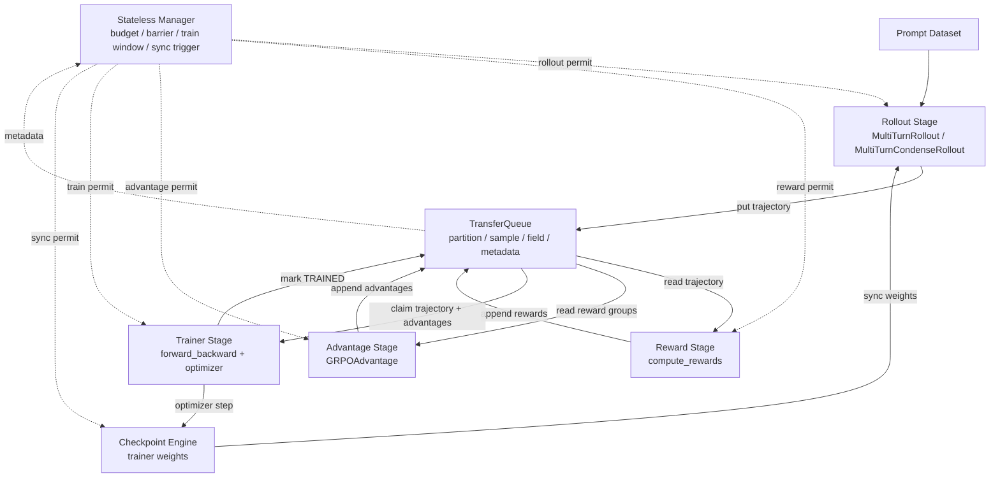
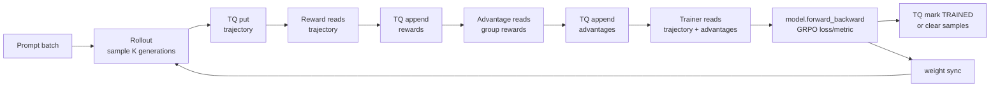

# 基于 TransferQueue 的 Agentic RL 设计规格

## 背景

Twinkle 目前已经具备 agentic RL 所需的主要组件：

- `MultiTurnRollout` / `MultiTurnCondenseRollout` 负责多轮轨迹生成，并通过 `ToolManager` 处理工具调用。
- `Reward` 及任务自定义 reward 模块负责对完成的轨迹打分。
- `GRPOAdvantage` 根据 reward 计算 group-relative advantage。
- `TransformersModel` / `MegatronModel` 通过 `forward_backward` 消费训练样本。
- `GRPOMetric` 和 `GRPOLoss` 消费 `old_logps` 与 `advantages`。
- checkpoint engine 负责把 trainer 权重同步给 rollout worker。

缺失的不是新的 rollout 实现，而是 rollout 和 trainer 之间的数据面边界。当前 RL 示例通常在同一个 driver loop 里直接传递 rollout 结果、reward、advantage 和 train batch，这会把 rollout latency、reward latency 和 trainer latency 耦合在一起。

本设计引入 TransferQueue 作为数据容器，用来解耦 rollout-side production 和 trainer-side consumption。同步 RL 和异步 RL 使用同一套数据路径；


## 核心原则

TransferQueue 只是数据容器。

它保存 sample 和 field。producer 追加 field，consumer 读取 field。它不应该决定系统是同步 RL 还是异步 RL。

控制策略由 stateless manager 负责：

- 同步 RL 中，manager 在 rollout、reward、advantage、train、weight sync 之间施加 barrier。
- 异步 RL 中，manager 允许 rollout 和 trainer 并行运行


## 组件总览

```text
                         StatelessManager
        permit: rollout / reward / advantage / train / sync
              .----------.----------.----------.----------.
              v          v          v          v          v

Prompt Dataset ---> Rollout Stage ---- put trajectory ----.
                         ^                                |
                         |                                v
Checkpoint Engine -- sync weights                  TransferQueue
                                                          ^
Reward Stage ------ read trajectory / append rewards -----|
Advantage Stage --- read rewards / append advantages -----|
Trainer Stage ----- claim trajectory+advantages / mark ---'
      |
      '-- optimizer step --> Checkpoint Engine

TransferQueue 只承载 partition、sample、field ready 状态和数据读写；
StatelessManager 只根据 metadata 发 permit，不搬运 trajectory/reward/advantage。
```



组件职责：

- `Rollout Stage`：复用现有 `MultiTurnRollout` / `MultiTurnCondenseRollout`，完成多轮生成、tool call 和轨迹截断处理，并将完成 trajectory 写入 TransferQueue。
- `Reward Stage`：调用任务自定义 reward，例如 `grpo_baseline.py` 里的 `compute_rewards(all_trajectories)`，向同一 sample 追加 reward 字段。
- `Advantage Stage`：按 GRPO group 聚合 reward，例如 `GRPOAdvantage()(total_rewards, num_generations=NUM_GENERATIONS, scale='group')`，并追加 `advantages`。
- `Trainer Stage`：读取训练字段 ready 的 samples，调用现有 `forward_backward`、loss、metric 和 optimizer step。
- `Checkpoint Engine`：沿用现有权重同步路径，将 trainer 权重同步给 rollout worker。
- `Stateless Manager`：只决定何时发放 budget、何时等待 barrier、何时触发权重同步；不持有样本数据，也不实现 queue 存储。
- `TransferQueue`：唯一的数据面容器，负责 partition、sample、field ready 状态和 tensor/meta 数据读写。

这里的 `Stage` 是逻辑阶段，不要求当前实现里已经拆成独立 worker。同步 baseline 中这些阶段都在同一个 driver loop 内顺序执行；异步模式才会把其中部分阶段变成可并行的 worker。

`grpo_baseline.py` 中的同步控制流对应如下：

```text
for batch in dataloader:
    batch_step = optim_step
    expand_prompts = repeat(batch, NUM_GENERATIONS)

    ckpt_manager.sync_weights()
    sampler.reset_prefix_cache()

    all_trajectories = rollout(expand_prompts)
    total_rewards, f1_rewards, cot_rewards = compute_rewards(all_trajectories)
    advantages = GRPOAdvantage()(total_rewards, num_generations=NUM_GENERATIONS, scale="group")

    if homogeneous_reward_group:
        log metrics
        optim_step += optim_steps_per_batch
        continue

    for mini_batch in all_trajectories:
        ref_logps = model.forward_only(..., disable_lora=True)  # optional KL
        model.forward_backward(
            inputs=mini_batch,
            old_logps=old_logps,
            advantages=advantages,
            ref_logps=ref_logps,
        )
        model.clip_grad_and_step()
        optim_step += 1
```


## 类设计

本设计在现有 Twinkle 组件外部增加 TransferQueue 和 StatelessManager。

`StatelessManager` 不保存 sample payload，也不实现 queue。它只根据 TransferQueue 的 metadata、当前 trainer step、policy version 和配置参数返回控制决策。

建议最小接口：

```python
@dataclass
class TransferQueueMetadata:
    partition_id: str
    rollout_done: int
    reward_done: int
    advantage_done: int
    training: int
    trained: int
    failed: int
    estimated_bytes: int
    min_policy_version: int | None
    max_policy_version: int | None


class StatelessManager:
    def next_partition(self, *, trainer_step: int) -> str:
        """返回当前逻辑 RL partition，例如 rl/train/{trainer_step}。"""

    def get_metadata(self, *, partition_id: str) -> TransferQueueMetadata:
        """从 TransferQueue 读取 metadata；不读取 tensor payload。"""

    def acquire_rollout_budget(
        self, *, metadata: TransferQueueMetadata, policy_version: int, target_samples: int
    ) -> int:
        """决定还能发放多少条 rollout permit。同步模式通常返回一个 batch 的固定预算。"""

    def can_run_reward(self, *, metadata: TransferQueueMetadata) -> bool:
        """rollout 字段 ready 且 reward backlog 非空时允许 reward 阶段运行。"""

    def can_run_advantage(self, *, metadata: TransferQueueMetadata, num_generations: int) -> bool:
        """GRPO group 内 reward 满足 num_generations 后允许 advantage 阶段运行。"""

    def acquire_train_budget(
        self, *, metadata: TransferQueueMetadata, required_fields: list[str], mini_batch_size: int
    ) -> int:
        """决定 trainer 可消费多少条字段 ready 的 sample。同步模式需要等完整 batch ready。"""

    def should_sync_weights(self, *, trainer_step: int, policy_version: int) -> bool:
        """决定是否触发 checkpoint engine 做 trainer -> rollout 的权重同步。"""

    def on_train_step_end(self, *, partition_id: str, trainer_step: int, metrics: dict) -> None:
        """接收训练进度和指标信号；不接收 sample payload。"""
```

不额外定义 `FlowDecision`。driver loop 直接调用上述方法即可，避免同时维护“聚合决策对象”和“单项判断方法”两套接口。

同步 baseline 可以只实现 `next_partition`、`should_sync_weights` 和保守的 budget/barrier 方法：

```text
sync_weights -> rollout full batch -> reward full batch -> advantage full batch -> train mini-batches
```

异步模式在同一组方法上放宽 barrier：`rollout_budget` 可以提前发放，`train_budget` 可以消费 rolling window 内已经 ready 的 samples，`sync_weights` 由 policy lag 或固定 step 间隔触发。


## Manager 控制算法

Manager 每个 control tick 只做三件事：

1. 读取当前 partition 的 TransferQueue metadata。
2. 根据同步/异步策略计算 permit。
3. driver loop 或 worker 根据 permit 执行实际 rollout、reward、advantage、train、sync。

### 基础计数

```text
target_rollout = global_batch_size * num_generations
required_train = floor(advantage_done / mini_batch_size) * mini_batch_size
reward_backlog = rollout_done - reward_done
advantage_backlog = reward_done - advantage_done
train_backlog = advantage_done - training - trained
inflight = rollout_done - trained
```

其中：

- `global_batch_size = batch_size * gradient_accumulation_steps`
- `target_rollout` 对应 `grpo_baseline.py` 里的 `len(expand_prompts)`
- `advantage_done` 表示已经有 `trajectory + rewards + advantages` 的样本数
- `training` 表示已经被 trainer 取走但还没标记完成的样本数

### 统一控制流

同步和异步使用同一个 driver loop。区别不应该体现在两套控制流里，而应该体现在参数上。

```text
partition = manager.next_partition(trainer_step)
metadata = manager.get_metadata(partition)

if manager.should_sync_weights(...):
    ckpt_manager.sync_weights()
    sampler.reset_prefix_cache()

rollout_budget = manager.acquire_rollout_budget(metadata, policy_version, target_rollout)
if rollout_budget > 0:
    rollout prompts and put trajectory

while manager.can_run_reward(metadata):
    read trajectory without rewards
    compute_rewards(...)
    append rewards
    refresh metadata

while manager.can_run_advantage(metadata, num_generations):
    read full reward groups
    GRPOAdvantage(...)
    append advantages
    refresh metadata

while train_budget := manager.acquire_train_budget(metadata, ["trajectory", "advantages"], mini_batch_size):
    read train_budget samples
    derive old_logps from trajectory["logprobs"]
    optional ref_logps = model.forward_only(..., disable_lora=True)
    model.forward_backward(...)
    model.clip_grad_and_step()
    mark trained
    refresh metadata
```

这个 loop 在同步模式中会因为 barrier 参数变成严格串行；在异步模式中会因为 rolling window 参数允许多个阶段并行推进。

### 统一参数

Manager 使用下面这组参数描述同步和异步：

```text
rollout_window_samples     # 一个 partition 内最多允许 rollout 领先多少 samples
reward_barrier_samples     # reward 启动前要求多少 rollout_done
advantage_barrier_groups   # advantage 启动前要求多少完整 reward group
train_barrier_samples      # trainer 启动前要求多少 advantage_done
sync_interval_steps        # 每多少个 optimizer step 同步一次权重
staleness_threshold        # 样本允许落后当前 policy_version 的最大版本数
max_inflight_samples       # queue 中未 trained 的最大样本数
```

同步模式参数：

```text
rollout_window_samples   = target_rollout
reward_barrier_samples   = target_rollout
advantage_barrier_groups = global_batch_size
train_barrier_samples    = target_rollout
sync_interval_steps      = 1
staleness_threshold      = 0
max_inflight_samples     = target_rollout
```

这组参数会得到 `grpo_baseline.py` 的行为：每个 batch 先 sync 权重，然后完整 rollout，再 reward，再 advantage，最后按 mini-batch train。

异步模式参数示例：

```text
rollout_window_samples   = trigger_parameter_sync_step * target_rollout
reward_barrier_samples   = 1
advantage_barrier_groups = 1
train_barrier_samples    = mini_batch_size
sync_interval_steps      = trigger_parameter_sync_step
staleness_threshold      = 1 或更大
max_inflight_samples     = (staleness_threshold + 1) * rollout_window_samples
```

这组参数允许 rollout、reward、advantage、trainer 对 ready samples 做 rolling consumption。

### 用户配置参数

对用户暴露的配置不应该是一堆内部 counter，而是少量能表达训练语义的参数：

```yaml
rl_flow:
  mode: sync                 # sync | async
  sync_interval_steps: 1     # trainer 每多少个 optimizer step 触发一次权重同步
  staleness_threshold: 0     # 允许样本落后当前 policy_version 的最大版本数
  rollout_window_batches: 1  # rollout 最多领先多少个 target_rollout
  max_inflight_batches: 1    # queue 中未 trained 的样本容量上限
  reward_barrier: full       # full | group | sample
  advantage_barrier: full    # full | group
  train_barrier: full        # full | mini_batch
```

`mode` 只是 preset，不应该分叉代码路径。它展开成同一套 manager 参数：

同步 preset：

```yaml
rl_flow:
  mode: sync
  sync_interval_steps: 1
  staleness_threshold: 0
  rollout_window_batches: 1
  max_inflight_batches: 1
  reward_barrier: full
  advantage_barrier: full
  train_barrier: full
```

异步 preset：

```yaml
rl_flow:
  mode: async
  sync_interval_steps: 4
  staleness_threshold: 1
  rollout_window_batches: 4
  max_inflight_batches: 8
  reward_barrier: sample
  advantage_barrier: group
  train_barrier: mini_batch
```

参数展开规则：

```text
rollout_window_samples = rollout_window_batches * target_rollout
max_inflight_samples = max_inflight_batches * target_rollout

reward_barrier_samples =
    target_rollout       if reward_barrier == "full"
    num_generations      if reward_barrier == "group"
    1                    if reward_barrier == "sample"

advantage_barrier_groups =
    global_batch_size    if advantage_barrier == "full"
    1                    if advantage_barrier == "group"

train_barrier_samples =
    target_rollout       if train_barrier == "full"
    mini_batch_size      if train_barrier == "mini_batch"
```

`staleness_threshold` 控制 policy lag：

```text
sample_policy_lag = current_policy_version - sample.policy_version
sample 可训练条件：sample_policy_lag <= staleness_threshold
```

含义：

- `staleness_threshold = 0`：严格 on-policy。trainer 只能消费当前 `policy_version` 的 samples；这就是同步 preset。
- `staleness_threshold = 1`：允许 trainer 消费上一个 policy version 的 samples，rollout 和 train 可以有一个版本的重叠。
- `staleness_threshold > 1`：吞吐更高，但 off-policy 风险更大，需要配合 KL、importance ratio clamp 或 sample drop 策略。

当样本超过 staleness 阈值时，默认处理是 `DROPPED`，不进入 trainer：

```text
if current_policy_version - sample.policy_version > staleness_threshold:
    mark sample as DROPPED
```

### 统一公式

policy lag：

```text
max_policy_lag = current_policy_version - min_policy_version
staleness_ok = max_policy_lag <= staleness_threshold
```

rollout budget：

```text
capacity_budget = max(0, max_inflight_samples - inflight)
window_budget = max(0, rollout_window_samples - inflight)
rollout_budget = min(capacity_budget, window_budget)
rollout_budget = 0 if not staleness_ok else rollout_budget
```

reward permit：

```text
reward_ready = rollout_done - reward_done
reward_barrier_open = rollout_done >= reward_barrier_samples
run_reward = reward_barrier_open and reward_ready > 0
```

advantage permit：

```text
reward_groups_ready = floor(reward_done / num_generations)
advantage_groups_done = floor(advantage_done / num_generations)
advantage_groups_ready = reward_groups_ready - advantage_groups_done
advantage_barrier_open = reward_groups_ready >= advantage_barrier_groups
run_advantage = advantage_barrier_open and advantage_groups_ready > 0
```

trainer budget：

```text
ready_to_train = advantage_done - training - trained
train_ready = ready_to_train >= train_barrier_samples
train_budget = floor(ready_to_train / mini_batch_size) * mini_batch_size
train_budget = 0 if not train_ready else train_budget
```

weight sync permit：

```text
sync_weights = trainer_step > 0 and trainer_step % sync_interval_steps == 0
```

同步和异步的差异只来自参数。同步模式把 barrier 设置成完整 batch，把 staleness 设置成 0，把 sync interval 设置成 1；异步模式降低 reward/train barrier，提高 rollout window 和 staleness threshold。


## TransferQueue 


### partition 的粒度

partition 表示一段可以统一调度和清理的 RL 数据窗口。它不是单条 trajectory，也不和单个 optimizer step 强绑定。

推荐格式：

```text
partition_id = "rl/{run_id}/policy/{policy_version}/window/{window_id}"
```

字段含义：

- `run_id`：一次训练任务的唯一 id。
- `policy_version`：rollout 使用的策略版本。每次 checkpoint sync 后递增。
- `window_id`：同一个 policy version 下的 rolling window 序号。

同步模式参数退化后，每个 partition 通常只包含一个完整 rollout batch：

```text
window_id = trainer_step
partition_size = target_rollout
```

异步模式中，一个 policy version 可以有多个 window；trainer 可以消费多个未过期 window 中已经 ready 的 samples：

```text
partition_size <= rollout_window_samples
valid_policy_versions = [current_policy_version - staleness_threshold, current_policy_version]
```

partition 生命周期：

```text
OPEN -> ROLLOUT_CLOSED -> TRAINING -> TRAINED -> CLEARED
```

- `OPEN`：允许写入 rollout samples。
- `ROLLOUT_CLOSED`：达到 `rollout_window_samples`，或 policy version 已切换且不再发放 rollout budget。
- `TRAINING`：至少有 sample 被 trainer 消费。
- `TRAINED`：partition 内所有可训练 samples 都训练完成，或被策略判定丢弃。
- `CLEARED`：TransferQueue 中的数据已清理。

manager 只根据 partition metadata 判断能否继续发放 budget；实际 sample 写入、读取、mark、clear 由各 stage 执行。


### key 设计

key 分三层：partition key、sample key、field key。

#### partition key

partition key 就是 `partition_id`：

```text
rl/{run_id}/policy/{policy_version}/window/{window_id}
```

所有 metadata、sample、field 都挂在这个 partition 下，便于按 window 做扫描和清理。

#### sample key

一条完成的 trajectory 是一个 sample。推荐 sample key：

```text
sample_id = "{prompt_uid}/g{generation_idx}"
```

如果 dataset 没有稳定 id，则由 dataloader 生成：

```text
prompt_uid = "{epoch}:{batch_idx}:{prompt_idx}"
sample_id = "{prompt_uid}/g{generation_idx}"
```

GRPO group key：

```text
group_id = "{prompt_uid}"
```

同一个 `group_id` 下应有 `num_generations` 条 samples。Advantage stage 按 `group_id` 聚合 reward。

#### field key

field key 使用固定列名，避免把业务语义编码进 key：

```text
trajectory
rewards
reward_components
reward_info
advantages
returns
ref_logps
policy_logps
values
status
```

状态字段：

```text
status = ROLLOUT_DONE | REWARD_DONE | ADVANTAGE_DONE | TRAINING | TRAINED | FAILED | DROPPED
```

#### metadata key

partition metadata 至少包含：

```text
partition_id
run_id
policy_version
window_id
created_at
closed_at, optional
rollout_done
reward_done
advantage_done
training
trained
failed
dropped
estimated_bytes
min_policy_version
max_policy_version
```

sample metadata 至少包含：

```text
sample_id
group_id
prompt_uid
generation_idx
policy_version
partition_id
created_at
updated_at
status
```

读写路径示例：

```text
put(partition_id, sample_id, field="trajectory", data=trajectory, meta=sample_meta)
append(partition_id, sample_id, field="rewards", data=rewards)
append(partition_id, sample_id, field="advantages", data=advantages)
mark(partition_id, sample_id, status="TRAINED")
```

每条完成的 trajectory 是一行 sample。后续阶段向同一行追加 field。这个设计依赖 TransferQueue 的动态列扩展能力。


高吞吐 tensor 数据优先使用 native `put/get_meta/get_data` 路径。细粒度状态更新和 partial field update 可以使用 KV API，例如 `kv_batch_put`、`kv_batch_get`、`kv_list`、`kv_clear`。具体选择由 Twinkle adapter 屏蔽。


## 数据 Schema

TransferQueue 的 sample payload 以 `trajectory` 为主。`trajectory` 直接沿用 rollout 当前返回的 dict，包含训练和 reward 所需字段，例如：

```text
trajectory = {
    input_ids,
    attention_mask,
    labels,
    logprobs,
    messages,
    turns,
    stop_reason,
    truncated,
    user_data,
    ...
}
```

不要在 TransferQueue schema 层把 `trajectory` 提前拆成大量独立列。拆字段会把 schema 绑定到某个 trainer/reward 实现，后续 rollout dict 增加字段时也更难兼容。

Reward 阶段追加轻量结果字段：

```text
rewards
reward_components, optional
reward_info, optional
```

Advantage 阶段追加：

```text
advantages
returns, optional
```

如果算法需要，reference/policy forward 阶段可以追加：

```text
ref_logps
policy_logps
values
```

GRPO trainer 消费：

```text
trajectory
old_logps, optional
advantages
ref_logps, optional
```

其中 `old_logps` 可以像 `grpo_baseline.py` 一样从 `trajectory["logprobs"]` 派生：

```python
old_logps = [[lp[0][1] for lp in (t.get("logprobs") or [])] for t in trajectories]
```

如果派生成本或数据量较大，可以把 `old_logps` 作为 TransferQueue 的附加字段缓存；但它不是 rollout schema 的第一层必需字段。


## GRPO 数据流



详细流程：

1. manager 为 `train_k` 发放 rollout budget。
2. 现有 rollout stage 从 dataset 取得 prompt trajectories。
3. `MultiTurnRollout` 或 `MultiTurnCondenseRollout` 执行现有多轮/tool loop。
4. rollout stage 将每条完成 `trajectory` 写入 TransferQueue，状态为 `ROLLOUT_DONE`。
5. reward stage 读取 `trajectory` ready 的 samples，计算 reward，并追加 `rewards` 字段。
6. advantage stage 等待 GRPO group 内 `num_generations` 条 sample 都有 reward，计算并追加 `advantages`。
7. trainer 读取训练所需字段 ready 的 samples，并调用 `forward_backward`。
8. optimizer step 完成后，trainer 将 samples 标记为 `TRAINED` 或从 partition 中清理。
9. 权重同步仍然由 checkpoint engine 处理。TransferQueue 只保存 `policy_version` 元数据和训练数据。


## Cookbook 伪代码

下面是把 `grpo_baseline.py` 改成 TransferQueue 数据路径后的伪代码。同步和异步共用这段 control loop；差异只来自 manager 参数。

```python
def run_grpo_with_transfer_queue(
    *,
    dataloader,
    rollout,
    model,
    sampler,
    ckpt_manager,
    tq,
    manager,
    advantage_fn,
    num_generations,
    global_batch_size,
    mini_batch_size,
    micro_batch_size,
    kl_beta,
):
    policy_version = 0
    trainer_step = 0
    target_rollout = global_batch_size * num_generations

    for batch in dataloader:
        partition_id = manager.next_partition(trainer_step=trainer_step)
        metadata = manager.get_metadata(partition_id=partition_id)

        if manager.should_sync_weights(
            trainer_step=trainer_step,
            policy_version=policy_version,
        ):
            ckpt_manager.sync_weights(merge_and_sync=False)
            sampler.reset_prefix_cache()
            policy_version += 1

        rollout_budget = manager.acquire_rollout_budget(
            metadata=metadata,
            policy_version=policy_version,
            target_samples=target_rollout,
        )
        if rollout_budget > 0:
            prompts = expand_prompts(batch, num_generations, limit=rollout_budget)
            trajectories = rollout(prompts)
            for trajectory in trajectories:
                sample_id = make_sample_id(trajectory)
                tq.put(
                    partition_id=partition_id,
                    sample_id=sample_id,
                    field="trajectory",
                    data=trajectory,
                    meta={
                        "group_id": make_group_id(trajectory),
                        "policy_version": policy_version,
                        "status": "ROLLOUT_DONE",
                    },
                )

        metadata = manager.get_metadata(partition_id=partition_id)
        while manager.can_run_reward(metadata=metadata):
            samples = tq.get_ready(
                partition_id=partition_id,
                has_fields=["trajectory"],
                missing_fields=["rewards"],
            )
            trajectories = [s["trajectory"] for s in samples]
            total_rewards, f1_rewards, cot_rewards = compute_rewards(trajectories)
            for sample, reward, f1, cot in zip(samples, total_rewards, f1_rewards, cot_rewards):
                tq.append(
                    partition_id=partition_id,
                    sample_id=sample["sample_id"],
                    field="rewards",
                    data=reward,
                    meta={
                        "reward_components": {"f1": f1, "cot": cot},
                        "status": "REWARD_DONE",
                    },
                )
            metadata = manager.get_metadata(partition_id=partition_id)

        while manager.can_run_advantage(
            metadata=metadata,
            num_generations=num_generations,
        ):
            groups = tq.get_ready_groups(
                partition_id=partition_id,
                group_size=num_generations,
                has_fields=["trajectory", "rewards"],
                missing_fields=["advantages"],
            )
            for group in groups:
                rewards = [s["rewards"] for s in group]
                advantages = advantage_fn(
                    rewards,
                    num_generations=num_generations,
                    scale="group",
                ).tolist()
                for sample, advantage in zip(group, advantages):
                    tq.append(
                        partition_id=partition_id,
                        sample_id=sample["sample_id"],
                        field="advantages",
                        data=advantage,
                        meta={"status": "ADVANTAGE_DONE"},
                    )
            metadata = manager.get_metadata(partition_id=partition_id)

        train_budget = manager.acquire_train_budget(
            metadata=metadata,
            required_fields=["trajectory", "advantages"],
            mini_batch_size=mini_batch_size,
        )
        while train_budget > 0:
            train_samples = tq.claim_for_training(
                partition_id=partition_id,
                limit=min(train_budget, mini_batch_size),
                required_fields=["trajectory", "advantages"],
            )
            trajectories = [s["trajectory"] for s in train_samples]
            advantages = [s["advantages"] for s in train_samples]
            old_logps = [
                [lp[0][1] for lp in (t.get("logprobs") or [])]
                for t in trajectories
            ]

            ref_logps = None
            if kl_beta > 0.0:
                ref_outputs = model.forward_only(
                    inputs=trajectories,
                    disable_lora=True,
                )
                ref_logps = ref_outputs.get("logps")

            model.forward_backward(
                inputs=trajectories,
                old_logps=old_logps,
                advantages=advantages,
                ref_logps=ref_logps,
                micro_batch_size=micro_batch_size,
            )
            model.clip_grad_and_step()

            tq.mark_batch(
                partition_id=partition_id,
                sample_ids=[s["sample_id"] for s in train_samples],
                status="TRAINED",
            )
            trainer_step += 1
            manager.on_train_step_end(
                partition_id=partition_id,
                trainer_step=trainer_step,
                metrics=model.calculate_metric(is_training=True),
            )

            metadata = manager.get_metadata(partition_id=partition_id)
            train_budget = manager.acquire_train_budget(
                metadata=metadata,
                required_fields=["trajectory", "advantages"],
                mini_batch_size=mini_batch_size,
            )
```

同步配置下，这段代码每轮会表现为：

```text
sync weights
rollout target_rollout samples
reward all rollout samples
advantage all reward groups
train all ready mini-batches
```

异步配置下，同一段代码会表现为：

```text
rollout 按 window 持续补样本
reward 消费已经完成的 trajectory
advantage 消费已经完整的 GRPO group
trainer 消费已经 ready 的 mini-batch
checkpoint sync 按 sync_interval_steps 触发
```
