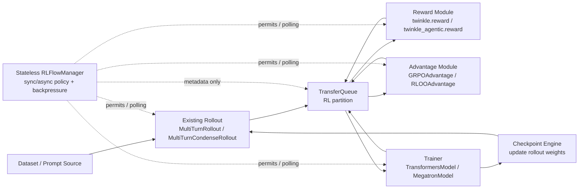
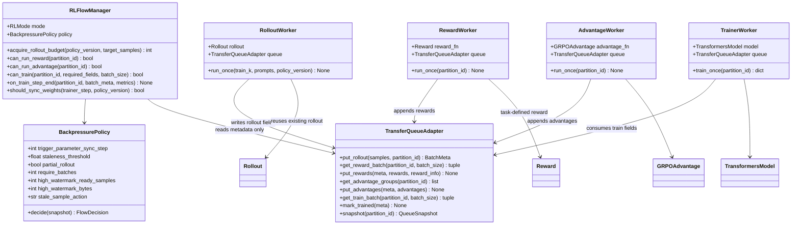
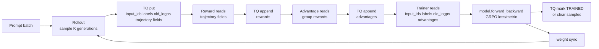
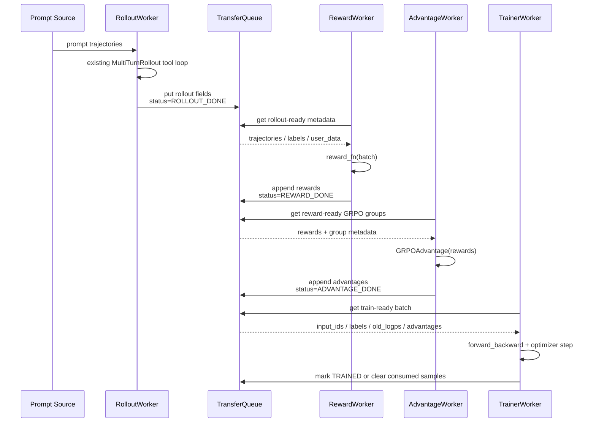
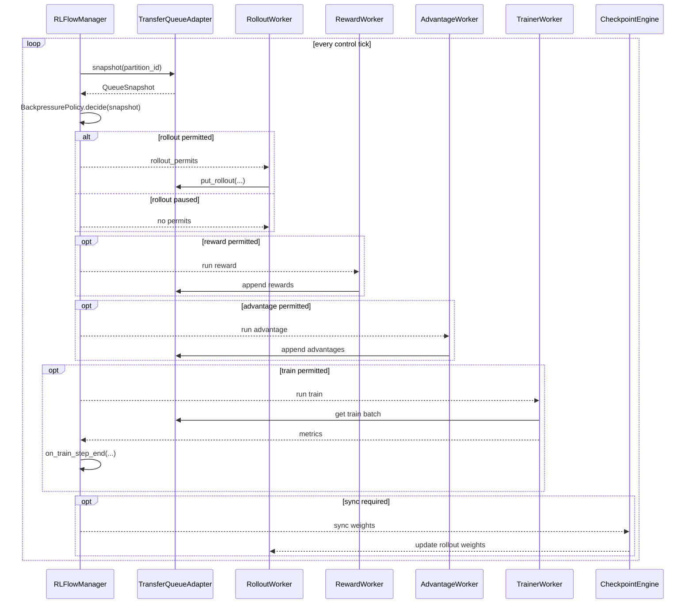
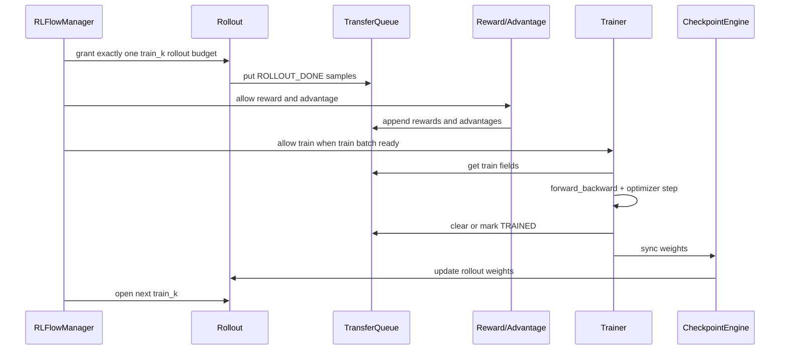

# 基于 TransferQueue 的 Agentic RL 设计规格

## 背景

Twinkle 目前已经具备 agentic RL 所需的主要组件：

- `MultiTurnRollout` / `MultiTurnCondenseRollout` 负责多轮轨迹生成，并通过 `ToolManager` 处理工具调用。
- `Reward` 及任务自定义 reward 模块负责对完成的轨迹打分。
- `GRPOAdvantage` 根据 reward 计算 group-relative advantage。
- `TransformersModel` / `MegatronModel` 通过 `forward_backward` 消费训练样本。
- `GRPOMetric` 和 `GRPOLoss` 消费 `old_logps` 与 `advantages`。
- checkpoint engine 负责把 trainer 权重同步给 rollout worker。

缺失的不是新的 rollout 实现，而是 rollout 和 trainer 之间的数据面边界。当前 RL 示例通常在同一个 driver loop 里直接传递 rollout 结果、reward、advantage 和 train batch，这会把 rollout latency、reward latency 和 trainer latency 耦合在一起。

本设计引入 TransferQueue 作为数据容器，用来解耦 rollout-side production 和 trainer-side consumption。同步 RL 和异步 RL 使用同一套数据路径；二者的区别由 stateless flow manager 及其 backpressure 策略控制，而不是通过改造 rollout class 实现。

## 目标

- 使用 TransferQueue 作为 rollout、reward、advantage、trainer 之间的共享数据容器。
- 保持现有 rollout 的交互流程不变。
- 保持任务定制仍然落在已有模块中：rollout/tool flow、env/tool handling、reward、advantage。
- 使用同一套数据面 API 支持同步 RL 和异步 RL。
- 明确 backpressure 的职责、输入和输出。
- 以 GRPO 作为第一阶段落地目标。

## 非目标

- TransferQueue 不是 RL scheduler。
- TransferQueue 不是环境抽象。
- TransferQueue 不负责 reward、advantage 或权重同步。
- 不需要引入 `AsyncMultiTurnRollout`。
- 不需要改变 `MultiTurnRollout` 当前的 tool 语义。

## 核心原则

TransferQueue 只是数据容器。

它保存 sample 和 field。producer 追加 field，consumer 读取 field。它不应该决定系统是同步 RL 还是异步 RL。

控制策略由 stateless manager 负责：

- 同步 RL 中，manager 在 rollout、reward、advantage、train、weight sync 之间施加 barrier。
- 异步 RL 中，manager 允许 rollout 和 trainer 并行运行，但通过 policy lag 和内存水位限制风险。

同步和异步模式使用相同的数据 schema。

## 组件总览



## 类设计

本设计在现有 Twinkle 组件外部增加 adapter 和 flow manager，不新增 rollout 算法。



`TransferQueueAdapter` 是 Twinkle 侧的封装层。它隐藏底层到底使用 TransferQueue native `put/get_meta/get_data`、KV API，还是 `StreamingDataset`。这样算法代码不依赖 TransferQueue 的具体 API 细节。

`RLFlowManager` 在 sample payload 维度是 stateless 的。它可以保存少量运行时计数，例如当前 `train_k`、当前 `policy_version`、上次 sync step，但不能保存 sample row，也不能变成 replay buffer。sample readiness 和生产/消费状态仍然由 TransferQueue 管理。

## TransferQueue 使用方式

每个训练窗口使用一个逻辑 RL partition：

```text
partition_id = "rl/train/{train_k}"
```

`train_k` 是逻辑训练窗口。同步模式中它通常对应一次 rollout-train iteration。异步模式中它可以对应 rolling window 或 policy version range。

每条完成的 trajectory 是一行 sample。后续阶段向同一行追加 field。这个设计依赖 TransferQueue 的动态列扩展能力。

推荐 sample key：

```text
sample_key = "{train_k}:{prompt_uid}:{generation_idx}"
```

推荐 tags：

```python
{
    "train_k": int,
    "prompt_uid": str,
    "group_id": str,
    "generation_idx": int,
    "policy_version": int,
    "status": str,
    "created_at": float,
    "updated_at": float,
    "retry_count": int,
}
```

推荐状态：

```text
ROLLOUT_DONE
REWARD_DONE
ADVANTAGE_DONE
TRAINING
TRAINED
DROPPED
FAILED
```

高吞吐 tensor 数据优先使用 native `put/get_meta/get_data` 路径。细粒度状态更新和 partial field update 可以使用 KV API，例如 `kv_batch_put`、`kv_batch_get`、`kv_list`、`kv_clear`。具体选择由 Twinkle adapter 屏蔽。

## 数据 Schema

Rollout 写入：

```text
input_ids
attention_mask
labels
loss_scale or completion_mask, optional
old_logps
messages, optional
tool_trace, optional
turns
stop_reason
truncated
user_data or custom_meta
```

Reward 追加：

```text
rewards
reward_components, optional
reward_info, optional
```

Advantage 追加：

```text
advantages
returns, optional
```

如果算法需要，reference/policy forward worker 可以追加：

```text
ref_logps
policy_logps
values
```

GRPO trainer 至少消费：

```text
input_ids
attention_mask
labels
old_logps
advantages
```

`messages`、`tool_trace` 等大的非 tensor 对象只在 reward、审计或 debug 需要时保存。小的路由元信息应放在 tag 或 `BatchMeta.custom_meta` 中。

## GRPO 数据流



详细流程：

1. manager 为 `train_k` 发放 rollout budget。
2. 现有 rollout worker 从 dataset 取得 prompt trajectories。
3. `MultiTurnRollout` 或 `MultiTurnCondenseRollout` 执行现有多轮/tool loop。
4. rollout worker 将每条完成 trajectory 写入 TransferQueue，状态为 `ROLLOUT_DONE`。
5. reward worker 读取 rollout 字段已 ready 的 samples，计算 reward，并追加 `rewards` 字段。
6. advantage worker 等待 GRPO group 内 `num_generations` 条 sample 都有 reward，计算并追加 `advantages`。
7. trainer 读取训练所需字段 ready 的 samples，并调用 `forward_backward`。
8. optimizer step 完成后，trainer 将 samples 标记为 `TRAINED` 或从 partition 中清理。
9. 权重同步仍然由 checkpoint engine 处理。TransferQueue 只保存 `policy_version` 元数据和训练数据。

## 数据面时序

数据面指 sample payload 的流动路径。同步和异步模式的数据面完全一致。



关键规则：每个阶段都向同一批 sample row 追加字段。目标设计中，各阶段不再通过 Python 变量直接传递大 batch。

## 各组件何时访问 TransferQueue

Rollout 只在一条 trajectory 完成后访问 TransferQueue。

默认不应该每个 agent turn 都写 TransferQueue。逐 turn 写入只适合作为 observability 数据，热路径应关闭。

Reward 在 rollout completion 后访问 TransferQueue：

```python
meta = tq_client.get_meta(
    data_fields=["messages", "input_ids", "labels", "user_data"],
    batch_size=reward_batch_size,
    partition_id=partition_id,
    task_name="reward",
)
batch = tq_client.get_data(meta)
rewards = reward_fn(batch)
reward_data = TensorDict(
    {"rewards": torch.tensor(rewards, dtype=torch.float32)},
    batch_size=len(rewards),
)
tq_client.put(data=reward_data, metadata=meta)
```

Advantage 在 reward completion 后访问 TransferQueue。对于 GRPO，它需要按 `group_id` 或 `(prompt_uid, train_k)` 分组，并等待 `num_generations` 条样本 ready。

Trainer 只读取 train-ready samples：

```python
meta = tq_client.get_meta(
    data_fields=["input_ids", "attention_mask", "labels", "old_logps", "advantages"],
    batch_size=global_train_batch_size,
    partition_id=partition_id,
    task_name="trainer",
)
batch = tq_client.get_data(meta)
train_inputs = {
    "input_ids": batch["input_ids"],
    "attention_mask": batch["attention_mask"],
    "labels": batch["labels"],
}
model.forward_backward(
    inputs=train_inputs,
    old_logps=batch["old_logps"],
    advantages=batch["advantages"],
)
model.clip_grad_and_step()
rl_tq.mark_trained(meta)
```

具体 API 可以由 Twinkle adapter 封装，但阶段所有权应保持不变。

## Stateless Flow Manager

manager 决定每个组件可以生产或消费多少数据。它不保存 sample payload，也不成为 replay buffer。

建议接口：

```python
class RLFlowManager:
    def acquire_rollout_budget(self, *, policy_version: int, target_samples: int) -> int:
        ...

    def can_run_reward(self, *, partition_id: str) -> bool:
        ...

    def can_run_advantage(self, *, partition_id: str) -> bool:
        ...

    def can_train(self, *, partition_id: str, required_fields: list[str], batch_size: int) -> bool:
        ...

    def on_train_step_end(self, *, partition_id: str, batch_meta, metrics: dict) -> None:
        ...

    def should_sync_weights(self, *, trainer_step: int, policy_version: int) -> bool:
        ...
```

manager 只读取 TransferQueue metadata、tags、counters，以及 trainer/rollout 的进度信号。

### Manager Snapshot

manager 基于轻量 snapshot 做决策：

```python
@dataclass
class QueueSnapshot:
    partition_id: str
    rollout_done: int
    reward_done: int
    advantage_done: int
    training: int
    trained: int
    failed: int
    estimated_bytes: int
    min_policy_version: int | None
    max_policy_version: int | None


@dataclass
class FlowDecision:
    rollout_permits: int
    run_reward: bool
    run_advantage: bool
    run_train: bool
    sync_weights: bool
    stale_action: str | None
```

`QueueSnapshot` 来自 TransferQueue metadata 和 tags。`FlowDecision` 被 worker 或 driver loop 消费。manager 不直接改 payload；实际 `put/get/mark` 由 worker 执行。

### 控制面时序

控制面决定各组件何时允许运行。



同步和异步模式使用同一个 control loop。同步模式返回保守决策并施加 barrier；异步模式根据 `trigger_parameter_sync_step`、`staleness_threshold` 和 `partial_rollout` 返回滚动 permits。

## 同步模式

同步 RL 使用同样的 TransferQueue 数据路径，但强制 barrier。



同步策略：

```text
trigger_parameter_sync_step = 1
staleness_threshold = 0
partial_rollout = false
rollout_window = one train_k
next_rollout waits for TRAINED + weight sync
```

该模式保留当前 on-policy 语义，只是把内存中的直接数据传递替换为 TransferQueue。

## 控制模式

manager 使用 3 个核心参数描述同步和异步策略：

```text
trigger_parameter_sync_step
staleness_threshold
partial_rollout
```

这三个参数比一组松散的 high/low watermark 更适合作为 RL 语义层的控制面。TransferQueue 的水位参数仍然存在，但只用于容量保护，不定义训练模式。

`staleness_threshold` 可以是小数。`0` 到 `1` 之间的值表示允许有限 stale samples，但不打开完整的额外 rollout window。

manager 根据 trainer batch 形态派生 rollout budget：

```text
base_rollout_budget = trigger_parameter_sync_step * require_batches * train_mini_batch_size

if staleness_threshold == 0:
    max_rollout_budget = base_rollout_budget
else:
    max_rollout_budget = (1 + staleness_threshold) * base_rollout_budget - stale_samples_from_last_window
```

在 Twinkle GRPO 中，`train_mini_batch_size` 应映射为一次 trainer update 需要的 completed rollout samples 数量。`require_batches` 是 streaming 粒度参数，默认应为 `1`。

| 模式 | `trigger_parameter_sync_step` | `staleness_threshold` | `partial_rollout` | 语义 |
| --- | ---: | ---: | --- | --- |
| on-policy pipeline | `1` | `0` | ignored | 最接近当前同步 on-policy |
| stream off-policy pipeline | `>1` | `0` | ignored | 同一版 rollout 参数服务多次 trainer update |
| async stream with stale samples | `>=1` | `>0` | `False` | rollout 和 trainer 并行，允许 stale sample，同步时等待活跃 rollout 完成 |
| async stream with partial rollout | `>=1` | `>0` | `True` | rollout 和 trainer 并行，允许 stale sample，同步时可中断并续跑 rollout |

`partial_rollout` 只有在 `staleness_threshold > 0` 时生效。`staleness_threshold = 0` 时，manager 不应中断活跃 rollout。

### on-policy pipeline

条件：

```text
trigger_parameter_sync_step = 1
staleness_threshold = 0
```

流程：

```text
Rollout 生成一批样本
Reward/Advantage 补齐训练字段
Trainer 训练这一批
Trainer 和 Rollout 同步参数
进入下一轮
```

该模式没有 stale sample，也没有 partial rollout。它保留最严格的 on-policy 语义，只是把原本的内存 handoff 替换为 TransferQueue。

### stream off-policy pipeline

条件：

```text
trigger_parameter_sync_step > 1
staleness_threshold = 0
```

流程：

```text
Rollout 使用当前参数生成 trigger_parameter_sync_step 轮训练所需样本
Trainer 每拿够一个训练 batch 就训练一次
Trainer 完成 trigger_parameter_sync_step 次 update 后同步参数
进入下一轮 rollout window
```

这里 `staleness_threshold=0`，所以不会跨参数版本消费旧 rollout 任务。但同一批 rollout 参数会被 trainer 连续训练多步，因此它是 stream off-policy。

### async stream with stale samples

条件：

```text
trigger_parameter_sync_step >= 1
staleness_threshold > 0
partial_rollout = False
```

流程：

```text
Rollout 持续生产样本
Trainer 持续消费 train-ready samples
Trainer 每完成 trigger_parameter_sync_step 次 update 后触发参数同步
如果 Rollout 仍有活跃任务，等待这些任务完成后再切换新参数
Trainer 可消费 policy_version 差距不超过 staleness_threshold 的样本
```

该模式引入 stale sample，但不打断正在运行的 rollout，适合 rollout latency 稳定或不希望中断环境交互的任务。

### async stream with partial rollout

条件：

```text
trigger_parameter_sync_step >= 1
staleness_threshold > 0
partial_rollout = True
```

流程：

```text
Rollout 持续生产样本
Trainer 持续消费 train-ready samples
Trainer 每完成 trigger_parameter_sync_step 次 update 后触发参数同步
如果 Rollout 仍有活跃任务，manager 可以请求中断
同步新参数后，Rollout 从未完成状态继续生成剩余样本
Trainer 可消费 policy_version 差距不超过 staleness_threshold 的样本
```

这是最充分的异步模式。它减少参数同步时等待长尾 rollout 完成的时间，但要求 rollout 侧能够保存并恢复未完成的 agent state。对于当前 `MultiTurnRollout`，第一版可以只定义接口，不强制实现 partial resume。

### 样本可训练条件

Trainer 只消费满足以下条件的样本：

```text
sample.status == ADVANTAGE_DONE
required train fields are ready
trainer_policy_version - sample.policy_version <= staleness_threshold
```

当 `staleness_threshold = 0` 时，trainer 只能消费当前 rollout window 内允许的样本。

## Backpressure 策略

Backpressure 分为两层：

1. RL 语义层：由 `trigger_parameter_sync_step`、`staleness_threshold`、`partial_rollout` 决定。
2. TransferQueue 容量层：由 ready sample 数量、partition bytes、worker backlog 决定，只负责防止内存和存储失控。

容量层输入：

- `ROLLOUT_DONE`、`REWARD_DONE`、`ADVANTAGE_DONE`、`TRAINING` 样本数量
- partition estimated bytes
- active rollout task 数量
- ready-to-train batch 数量
- trainer throughput

容量层输出：

- rollout permit count
- reward/advantage permit
- train permit
- stale sample action
- partial rollout interrupt request
- weight sync decision

默认容量保护：

```text
if tq_bytes >= high_watermark_bytes:
    pause rollout permits

if ready_to_train >= high_watermark_ready_samples:
    pause rollout permits

otherwise:
    allow rollout permits

if no train-ready batch exists:
    keep trainer polling

if trainer_policy_version - sample.policy_version > staleness_threshold:
    mark sample DROPPED

if sync is due and partial_rollout is True:
    request rollout interruption

if sync is due and partial_rollout is False:
    wait active rollout tasks finish
```

manager 可以实现为简单 polling loop。它不需要保存持久 sample 状态，因为 TransferQueue 已经保存生产/消费状态。

## 失败处理

Rollout 失败：

- 标记 sample 为 `FAILED`
- 保留 prompt metadata 以便 retry
- 仅当 `retry_count < max_retries` 时重试

Reward 失败：

- 追加 `reward_info.error`
- 标记 sample 为 `FAILED`，或使用配置的 fallback reward

Advantage 失败：

- 通常说明 GRPO group 不完整
- 保持 samples pending，直到 group timeout
- timeout 后 drop 不完整 group，或使用 fallback batch-level advantage

Trainer 失败：

- optimizer step 成功前不要 clear samples
- 如果 train batch 在 step 前失败，应 release 或 retry metadata
- 如果 step 成功但 clear 失败，tag 更新必须是幂等的

## 初始实现计划

Phase 1：同步数据面替换。

- 增加 Twinkle TransferQueue adapter。
- 保持单 driver 进程。
- 将 GRPO 示例中的 Python-list handoff 替换为 TransferQueue 写入和读取。
- 保持现有 rollout、reward、advantage、trainer 调用不变。

Phase 2：异步 workers。

- 将 rollout、reward、advantage、trainer 作为独立 workers 运行。
- 增加基于 `trigger_parameter_sync_step`、`staleness_threshold`、`partial_rollout` 的 stateless manager。
- 增加 policy-version 和 stale-sample 处理。

Phase 3：trainer streaming input。

- 为 trainer consumption 集成 TransferQueue `StreamingDataset` / `StreamingDataLoader`。
- 对 DP groups 使用 rank-aware sampling。
- 保持 rollout-side production 不变。

## 配置示例

```yaml
rl:
  mode: sync  # sync | async
  algorithm: grpo
  num_generations: 8
  partition_prefix: rl/train

transfer_queue:
  backend: SimpleStorage
  polling_mode: true
  pre_alloc_sample_num: 1024

flow_manager:
  trigger_parameter_sync_step: 1
  staleness_threshold: 0
  partial_rollout: false
  require_batches: 1
  high_watermark_ready_samples: 512
  high_watermark_bytes: 64GB
  stale_sample_action: drop

rollout:
  class: MultiTurnRollout
  max_turns: 6
  max_trajectory_tokens: 8192

trainer:
  required_fields:
    - input_ids
    - attention_mask
    - labels
    - old_logps
    - advantages
```

推荐配置：

```text
on-policy:
  trigger_parameter_sync_step = 1
  staleness_threshold = 0

stream off-policy:
  trigger_parameter_sync_step > 1
  staleness_threshold = 0

async stale:
  trigger_parameter_sync_step >= 1
  staleness_threshold > 0
  partial_rollout = false

async partial:
  trigger_parameter_sync_step >= 1
  staleness_threshold > 0
  partial_rollout = true
```

## 待确认问题

- 第一版实现应该使用 TransferQueue native `put/get_meta/get_data`，还是使用 KV API 做 partial field update。
- `messages` 应作为 TransferQueue non-tensor field 存储，还是完全移到 `custom_meta` / trace files。
- stale samples 应该 drop、降权训练，还是使用显式 importance correction。
- 当前 `MultiTurnRollout` 是否需要为 `partial_rollout=True` 增加可中断/可恢复的 agent state 接口。
- 如何把 TransferQueue metrics 接入 Twinkle 现有日志体系。
