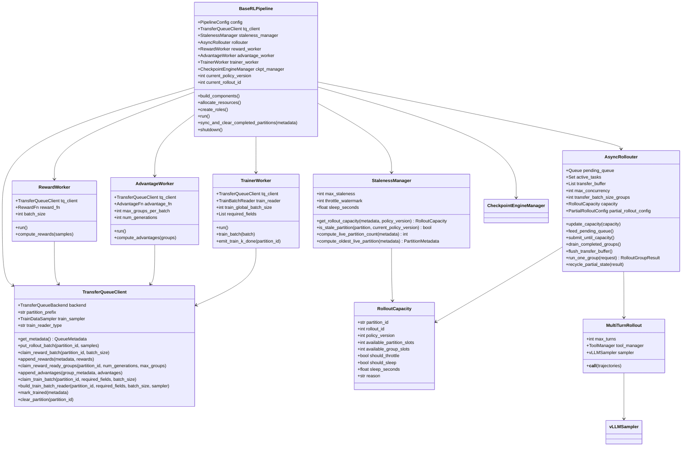
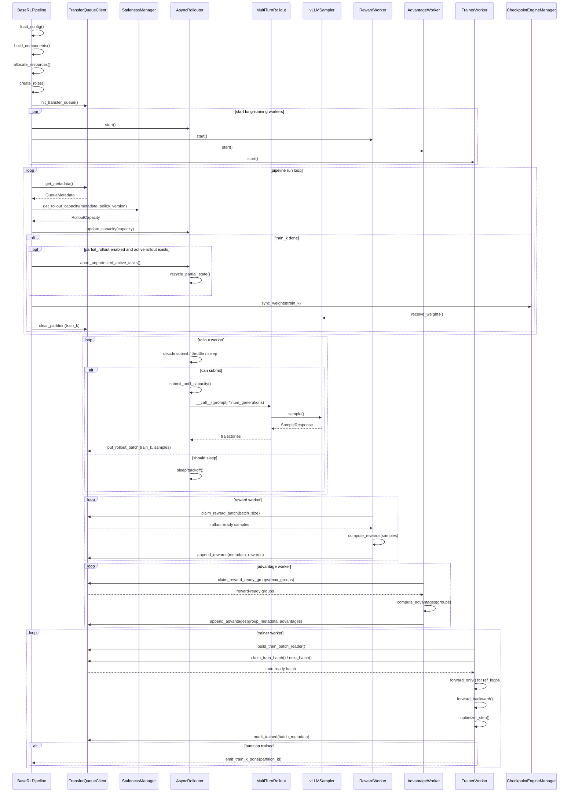

# 基于 TransferQueue 的 Agentic RL 详细设计

## 0. 概念澄清

### 0.1 组件边界

本设计中的核心组件分为五类：

```text
BaseRLPipeline:
  训练编排入口，负责初始化组件、创建角色、驱动主循环、处理 train_k done 后的权重同步和 partition 清理。

TransferQueueClient:
  独立的 TQ 访问组件。所有组件都通过它访问 TransferQueue，不直接调用底层 TQ API。

StalenessManager:
  只负责根据 TQ metadata 和 max_staleness 计算 rollout capacity / throttle / sleep hint。
  它不提交 rollout task，不控制 reward/advantage/train 消费额度，也不控制权重同步。

AsyncRollouter:
  rollout 生产运行时。它结合 StalenessManager 返回的 capacity、配置最大并发数、active_tasks、pending_queue、transfer_buffer，自行决定 submit / throttle / sleep。

RewardWorker / AdvantageWorker / TrainerWorker:
  长期运行的 TQ 消费者。它们按各自配置的 batch size 从 TQ claim ready 数据。
```

### 0.2 数据单位

```text
prompt group:
  一个 prompt 对应 rollout.num_generations 条 trajectories。
  GRPO advantage 默认以 prompt group 为单位计算。

trajectory sample:
  TransferQueue 中的一行样本。

transfer batch:
  AsyncRollouter 将若干 ready prompt groups 聚合后，一次写入 TransferQueue。

partition / train_k:
  一个 rollout step 的数据生命周期单位。
  一个 train_k 内部可以多次 append rollout-ready rows。

policy_version:
  rollout 使用的参数版本。
  第一版要求一个 train_k 对应一个 policy_version。
```

### 0.3 同步与 staleness

```text
权重同步:
  每个 train_k 训练完成后同步一次。
  BaseRLPipeline 调用 CheckpointEngineManager，同步完成后 clear_partition(train_k)。

staleness 控制:
  StalenessManager 只计算 rollout capacity。
  AsyncRollouter 根据 capacity 决定是否继续提交 rollout task。

mixed-version batch:
  第一版不支持。
  Trainer batch 只来自同一个 train_k / policy_version。
```

### 0.4 TransferQueueClient 的定位

`TransferQueueClient` 是独立组件，是所有 TQ 操作的唯一入口：

```text
BaseRLPipeline:
  get_metadata()
  clear_partition(train_k)

AsyncRollouter:
  put_rollout_batch(train_k)

RewardWorker:
  claim_reward_batch()
  append_rewards()

AdvantageWorker:
  claim_reward_ready_groups()
  append_advantages()

TrainerWorker:
  claim_train_batch()
  build_train_batch_reader()
  mark_trained()
```

## 1. 类图设计

### 1.1 总体类图



### 1.2 Metadata 类

```python
@dataclass
class QueueMetadata:
    active_partitions: list[PartitionMetadata]
    total_bytes: int | None
    trainer_step: int
    current_policy_version: int


@dataclass
class PartitionMetadata:
    partition_id: str
    rollout_id: int
    policy_version: int
    target_groups: int
    rollout_done_groups: int
    reward_done_groups: int
    advantage_done_groups: int
    trained_groups: int
    dropped_groups: int
    is_rollout_done: bool
    is_train_done: bool
```

### 1.3 Rollout 数据类

```python
@dataclass
class RolloutGroupRequest:
    prompt: Trajectory
    rollout_id: int
    partition_id: str
    group_id: str
    num_generations: int
    policy_version: int
    partial_state: dict | None = None
    abort_count: int = 0
    protected: bool = False


@dataclass
class RolloutGroupResult:
    request: RolloutGroupRequest
    trajectories: list[Trajectory]
    status: str  # ok / timeout / aborted / failed
    partial_state: dict | None = None
    error: str | None = None


@dataclass
class PartialRolloutConfig:
    enabled: bool = False
    max_aborted_count: int = 3
    mask_offpolicy_tokens: bool = True
```

### 1.4 训练数据读取类

```python
class TrainBatchReader:
    def next_batch(self) -> dict:
        ...


class ClaimBasedTrainBatchReader(TrainBatchReader):
    """默认实现：内部调用 TransferQueueClient.claim_train_batch()."""


class StreamingTrainBatchReader(TrainBatchReader):
    """可选实现：内部封装 TransferQueue StreamingDataLoader。"""
```

## 2. 异步 RL 编排时序图



## 3. Staleness 控制

### 3.1 输入与输出

`StalenessManager` 输入：

```text
QueueMetadata
current_policy_version
max_staleness
```

`StalenessManager` 输出：

```python
@dataclass
class RolloutCapacity:
    partition_id: str
    rollout_id: int
    policy_version: int
    available_partition_slots: int
    available_group_slots: int
    should_throttle: bool
    should_sleep: bool
    sleep_seconds: float
    reason: str
```

### 3.2 控制原则

第一版采用 Relax-style partition 级 staleness：

```text
max_live_partitions = max_staleness + 1
```

判断逻辑：

```text
active_partitions = metadata.active_partitions
oldest_live_partition = min(active_partitions.rollout_id)
live_partition_count = len(active_partitions)

if live_partition_count >= max_staleness + 1:
    available_partition_slots = 0
else:
    available_partition_slots = max_staleness + 1 - live_partition_count
```

`AsyncRollouter` 不直接使用这个值提交 task，而是结合本地状态：

```text
can_submit =
  capacity.available_partition_slots > 0
  and len(active_tasks) < max_concurrency
  and not capacity.should_sleep
  and pending_queue is not empty
```

### 3.3 throttle / sleep

建议将 staleness 控制分成三档：

```text
normal:
  live_partition_count < max_staleness + 1
  AsyncRollouter 正常提交，受 max_concurrency 限制。

throttle:
  live_partition_count 接近上限，或 TQ bytes 接近保护阈值。
  AsyncRollouter 降低提交速率，例如减少每轮 submit 数或增加短 sleep。

sleep:
  live_partition_count >= max_staleness + 1
  或 oldest train_k 长时间未训练完成。
  AsyncRollouter 暂停提交新 rollout task，等待 trainer clear partition。
```

### 3.4 与权重同步的关系

`StalenessManager` 不控制权重同步。

权重同步固定发生在：

```text
TrainerWorker 完成 train_k
  -> BaseRLPipeline.sync_weights()
  -> CheckpointEngineManager
  -> vLLMSampler.receive_weights()
  -> TransferQueueClient.clear_partition(train_k)
```

partition 被 clear 后，下一次 `get_metadata()` 会反映 active partition 数减少，`StalenessManager` 计算出的 capacity 自然变大。

### 3.5 partial rollout

当 `partial_rollout.enabled = true`，并且 train_k done 触发权重同步时：

```text
BaseRLPipeline 通知 AsyncRollouter:
  abort_unprotected_active_tasks()

AsyncRollouter:
  导出 partial_state
  abort_count += 1
  如果 abort_count >= max_aborted_count，则 protected = true
  将 partial request 放回 pending_queue
```

续跑后的 sample 写入当前 train_k / policy_version。旧版本 token 只作为上下文：

```text
loss_mask[:offpolicy_token_count] = 0
loss_mask[offpolicy_token_count:] = 1
```

## 4. 用户定制钩子

### 4.1 自定义 rollout 产生流程

如果用户有全新的 agentic 训练任务，通常只需要继承 rollout 相关类，不需要修改 pipeline。

可定制点：

```python
class CustomRollout(MultiTurnRollout):
    def build_initial_messages(self, prompt: Trajectory) -> list[dict]:
        ...

    def parse_model_response(self, response_text: str) -> dict:
        ...

    def execute_tool_or_env_step(self, parsed_response: dict) -> dict:
        ...

    def build_next_observation(self, tool_result: dict) -> dict:
        ...

    def should_stop(self, state: dict) -> bool:
        ...
```

适用场景：

```text
Code Agent:
  模型生成代码 -> sandbox 执行 -> 解析 stdout/stderr/test result -> 下一轮 observation

Visual Tool Agent:
  模型生成 zoom/rotate/crop tool call -> env 执行 -> 返回图像 observation

Search Agent:
  模型生成检索 query -> tool manager 调用搜索 API -> 返回片段 -> 下一轮回答
```

### 4.2 自定义 env/tool

如果任务需要复杂环境状态，建议提供 `BaseInteractionEnv`：

```python
class BaseInteractionEnv:
    def reset(self, prompt: Trajectory) -> tuple[dict, dict]:
        ...

    def step(self, response_text: str) -> tuple[dict, bool, dict]:
        ...

    def format_observation(self, observation: dict) -> Trajectory:
        ...
```

边界：

```text
env/tool 负责交互过程。
reward 仍然由 RewardWorker 计算。
env 不直接写 TransferQueue。
```

### 4.3 自定义 reward / advantage

```python
class RewardFn:
    def __call__(self, samples: list[dict]) -> list[dict]:
        ...


class AdvantageFn:
    def __call__(self, groups: list[list[dict]]) -> list[list[float]]:
        ...
```

GRPO 默认要求 group 完整：

```text
(partition_id, group_id)
  -> num_generations 条 samples
  -> rewards ready
  -> compute group-relative advantages
```

### 4.4 自定义 trainer batch 读取

如果默认 claim-based reader 不满足需求，可以替换 `TrainBatchReader`：

```python
class CustomTrainBatchReader(TrainBatchReader):
    def next_batch(self) -> dict:
        ...
```

可定制策略：

```text
length-balanced batch
rank-aware streaming batch
GRPO group-complete sampler
StreamingDataLoader-backed reader
```

约束：

```text
第一版 batch 必须来自同一个 train_k / policy_version。
不能绕过 TransferQueueClient 直接访问底层 TQ。
```

### 4.5 自定义 staleness 策略

```python
class CustomStalenessManager(StalenessManager):
    def get_rollout_capacity(
        self,
        metadata: QueueMetadata,
        policy_version: int,
    ) -> RolloutCapacity:
        ...
```

可定制内容：

```text
throttle watermark
sleep_seconds
TQ bytes 保护阈值
oldest partition 等待时间阈值
rollout capacity 计算方式
```

不可定制越界：

```text
不保存 sample payload。
不实现 replay buffer。
不控制 reward/advantage/train 消费额度。
不控制权重同步。
```

### 4.6 自定义编排流程

如果要新增完整算法流程，可以继承 `BaseRLPipeline`。

需要重写的方法：

```python
class CustomRLPipeline(BaseRLPipeline):
    def build_components(self) -> None:
        """创建 model、sampler、rollout、reward、advantage、trainer、TQ client、manager。"""

    def allocate_resources(self) -> None:
        """分配 DeviceMesh、remote workers、TransferQueue backend。"""

    def create_roles(self) -> None:
        """创建 RolloutWorker、RewardWorker、AdvantageWorker、TrainerWorker。"""

    def run(self) -> None:
        """如需改变主循环，重写 run；默认主循环已覆盖 GRPO async pipeline。"""

    def sync_and_clear_completed_partitions(self, metadata: QueueMetadata) -> None:
        """控制 train_k done 后的 sync weights 与 clear partition。"""

    def should_stop(self) -> bool:
        """定义训练终止条件。"""
```

通常不建议重写：

```text
TransferQueueClient 底层读写协议
TransferQueue row/field schema
StalenessManager 的 sample payload 访问边界
```

### 4.7 用户最小接入面

普通新任务一般只需要提供：

```text
1. Dataset / processor
2. Rollout prompt template
3. MultiTurnRollout 子类或 BaseInteractionEnv
4. ToolManager / sandbox / external tool adapter
5. RewardFn
6. YAML 配置
```

算法级扩展才需要改：

```text
AdvantageFn
TrainBatchReader
TrainerWorker
StalenessManager
BaseRLPipeline
```

## 5. 参数配置示例

下面是一个 GRPO + agentic multi-turn rollout + TransferQueue 的 YAML 示例。字段名用于表达设计意图，实际落地时可以按 Twinkle 现有配置系统调整层级。

```yaml
pipeline:
  class: AsyncAgenticGRPOPipeline
  max_steps: 1000
  log_interval: 10
  save_interval: 100

model:
  class: MegatronModel
  model_id: ms://Qwen/Qwen3.5-4B
  loss: GRPOLoss
  metric: GRPOMetric

sampler:
  class: vLLMSampler
  engine_args:
    max_model_len: 32768
    enable_lora: true
    max_lora_rank: 32

transfer_queue:
  client_class: TransferQueueClient
  partition_prefix: train
  backend: auto
  train_reader: claim                # claim / streaming_dataloader
  sampler: grpo_group
  max_tq_bytes: null                 # 可选保护阈值

staleness:
  manager_class: StalenessManager
  max_staleness: 1                   # 最多允许 rollout 领先 trainer 的未完成 train_k 数
  throttle_watermark: 0.8            # 接近上限时降低 rollout submit 速率
  sleep_seconds: 1.0                 # 超过安全范围时 AsyncRollouter 的 sleep/backoff 时间

partition:
  target_groups: 128                 # 一个 train_k 目标收集多少个 prompt group

rollout_worker:
  class: RolloutWorker
  runtime: AsyncRollouter
  queue_size: 128
  max_concurrency: auto
  transfer_batch_size_groups: auto
  group_timeout_s: 600
  max_retries: 1

rollout:
  class: MultiTurnRollout
  max_turns: 6
  num_generations: 8
  max_trajectory_tokens: null
  env_class: null                    # 可替换为自定义 BaseInteractionEnv
  tool_manager_class: ToolManager

partial_rollout:
  enabled: false
  max_aborted_count: 3
  mask_offpolicy_tokens: true

reward_worker:
  class: RewardWorker
  batch_size: 64
  reward_fn:
    class:
      - F1Reward
      - CoTReward
    weights:
      f1: 1.0
      cot: 0.2

advantage_worker:
  class: AdvantageWorker
  advantage_fn: GRPOAdvantage
  max_groups_per_batch: 32
  scale: group

trainer_worker:
  class: TrainerWorker
  train_global_batch_size: 64
  micro_batch_size: 2
  gradient_accumulation_steps: 1
  required_fields:
    - input_ids
    - labels
    - old_logps
    - advantages
    - loss_mask
  ref_logps:
    mode: trainer_forward_only
    disable_lora: true
  kl_beta: 0.02

checkpoint:
  engine: HCCLCheckpointEngine       # 或 NCCLCheckpointEngine
  sync_on_train_k_done: true         # 第一版固定语义：每个 train_k 完成后同步一次
  merge_and_sync: false

custom_hooks:
  rollout_class: null                # 自定义 rollout 产生流程
  env_class: null                    # 自定义环境交互
  reward_fn_class: null              # 自定义 reward
  advantage_fn_class: null           # 自定义 advantage
  train_batch_reader_class: null     # 自定义 trainer batch 读取策略
  staleness_manager_class: null      # 自定义 staleness 策略
```

关键参数含义：

| 参数 | 含义 |
|---|---|
| `partition.target_groups` | 一个 `train_k` 目标收集的 prompt group 数 |
| `rollout.num_generations` | 每个 prompt 生成多少条 trajectory，GRPO 默认按这个 group 计算 advantage |
| `rollout_worker.max_concurrency` | `AsyncRollouter` 同时运行的 prompt group task 上限 |
| `rollout_worker.transfer_batch_size_groups` | 每次写入 TQ 的 ready group 数 |
| `staleness.max_staleness` | rollout 最多领先 trainer 的未完成 `train_k` 数 |
| `staleness.throttle_watermark` | 接近 staleness 上限时触发降速 |
| `partial_rollout.enabled` | 是否启用中断回收和续跑 |
| `transfer_queue.train_reader` | trainer 侧使用 claim-based reader 还是 StreamingDataLoader |
| `trainer_worker.required_fields` | trainer claim batch 时必须 ready 的字段 |
| `checkpoint.sync_on_train_k_done` | 每个 `train_k` 完成后同步一次权重，第一版固定为 true |
